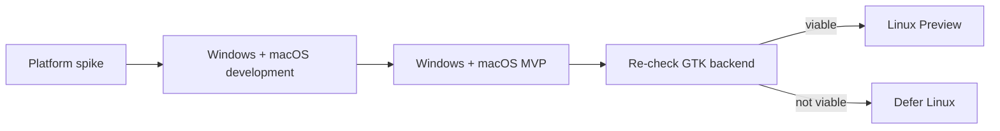

# Loregrove Codex Runbook

Run prompts in order. Prompt 00 is a mandatory architecture gate.

## Sequence

0. `codex/00_PLATFORM_SPIKE.md`
1. `codex/01_REPO_BOOTSTRAP.md`
2. `codex/02_LIBRARY_FOUNDATION.md`
3. `codex/03_SQLITE_PERSISTENCE.md`
4. `codex/04_DESKTOP_LIBRARY_UI.md`
5. `codex/05_PARSING_ABSTRACTION.md`
6. `codex/06_DOCLING_SUPERVISOR.md`
7. `codex/07_DOCLING_CONVERSION.md`
8. `codex/08_CHUNKING_AND_FTS.md`
9. `codex/09_AI_PROVIDER_CONFIGURATION.md`
10. `codex/10_EMBEDDINGS_VECTOR_SEARCH.md`
11. `codex/11_KNOWLEDGE_CANDIDATES.md`
12. `codex/12_CANONICAL_KNOWLEDGE.md`
13. `codex/13_ENTITY_RESOLUTION_REVIEW.md`
14. `codex/14_KNOWLEDGE_BROWSER.md`
15. `codex/15_EVIDENCE_GROUNDED_ASK.md`
16. `codex/16_KNOWLEDGE_HEALTH_REFLECTION.md`
17. `codex/17_BACKUP_RESTORE.md`
18. `codex/18_DESKTOP_PACKAGING_MVP.md`

Post-MVP:

19. `codex/19_LINUX_GTK_PREVIEW.md`

## Gate reviews

Stop for explicit architecture/product review after:

- 00 — desktop platform validation
- 03 — persistence foundation
- 07 — document processing
- 10 — search foundation
- 13 — resolution/clarification differentiation
- 16 — knowledge maintenance
- 18 — Windows/macOS MVP
- 19 — Linux preview decision

Do not continue blindly through a failed gate.

## MVP boundary

Prompts 00–18 define the MVP path.

Prompt 19 is explicitly post-MVP.

## Platform release policy

Linux backend maturity must never block Windows/macOS.
