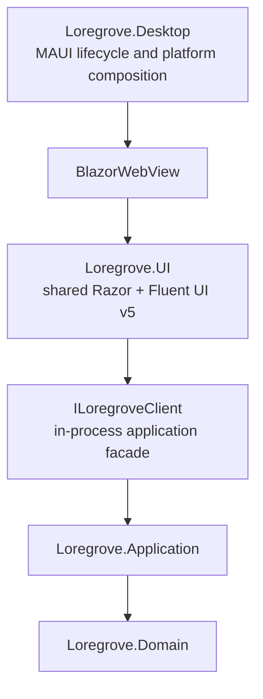

# Loregrove

Loregrove is a local-first personal knowledge compiler.

This repository contains the production architecture, desktop shell, and local evidence-library
foundation. The shared Fluent Library supports native multi-file selection, bounded durable imports,
duplicate reporting, paged/filterable SQLite results, and source metadata details. Captured TXT and
Markdown sources can now be parsed into immutable deterministic artifacts and structured Tier-2
source anchors. Search, AI, Docling, and knowledge extraction are not implemented yet.

## Current targets

- Windows through .NET MAUI, WinUI 3, and WebView2
- macOS through .NET MAUI, Mac Catalyst, and WKWebView

Mac Catalyst compiles as a production target, but its runtime behavior must still pass the
[macOS validation gate](docs/platform/macos-validation.md) on macOS.

## Future

Linux remains a post-MVP experiment. There is no Linux head or Linux-specific dependency in the
production solution.

## UI architecture

The desktop host uses .NET 10 MAUI Blazor Hybrid. Primary application UI is implemented once in the
`Loregrove.UI` Razor Class Library with Fluent UI Blazor v5.



There is no localhost web server or REST boundary between Razor and application services. The MAUI
host contains only the root `BlazorWebView`; it does not duplicate product screens.

## Repository structure

```text
src/
  Loregrove.Domain/
  Loregrove.Application/
  Loregrove.UI/
  Loregrove.Desktop/
  Loregrove.Infrastructure.Sqlite/
  Loregrove.Infrastructure.LocalFiles/
  Loregrove.Infrastructure.Search/
  Loregrove.Infrastructure.AI/
  Loregrove.Infrastructure.Docling/
  Loregrove.Infrastructure.Desktop/
tests/
  Loregrove.UnitTests/
  Loregrove.ContractTests/
  Loregrove.IntegrationTests/
  Loregrove.UITests/
  Loregrove.EndToEndTests/
```

`Loregrove.slnx` is the complete Windows/macOS production solution. `Loregrove.Core.slnx` excludes
the MAUI host so fast validation can run on Linux.

## Build

The repository pins .NET SDK `10.0.110`, .NET MAUI `10.0.90`, and Fluent UI Blazor
`5.0.0-rc.4-26180.1` through Central Package Management. Fluent v5 is a prerelease dependency and
the desktop host preserves its required Hybrid initializer-loader workaround.

```powershell
dotnet restore Loregrove.Core.slnx
dotnet test Loregrove.Core.slnx -c Release
dotnet build src/Loregrove.Desktop/Loregrove.Desktop.csproj -f net10.0-windows10.0.19041.0 -c Release
```

See [production boundaries](docs/architecture/production-boundaries.md),
[local source capture](docs/architecture/source-capture.md),
[SQLite persistence](docs/architecture/sqlite-persistence.md),
[Library UI and source import](docs/architecture/library-ui-and-import.md),
[parsing and source anchors](docs/architecture/parsing-and-source-anchors.md),
[Windows validation debt](docs/platform/windows-validation.md), and
[macOS validation debt](docs/platform/macos-validation.md) for the current implementation status.
