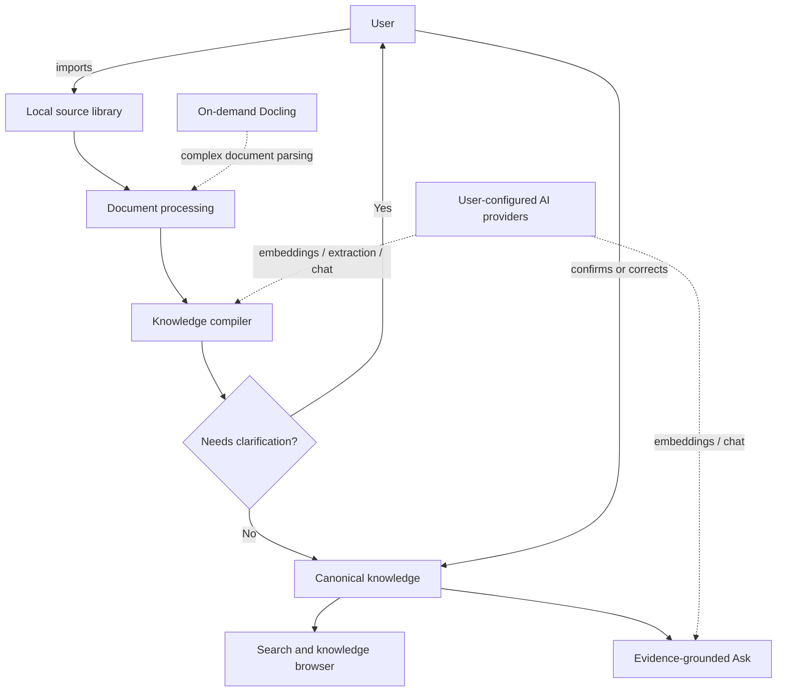

# Product Vision

## Problem

People continuously accumulate useful material in PDFs, DOCX files, spreadsheets, screenshots, scans, notes, and other formats. Storage is easy; maintaining useful organization is not.

Most personal knowledge systems push recurring maintenance back onto the user:

- tagging
- filing
- categorizing
- summarizing
- linking
- deduplicating
- reconciling contradictions
- remembering why a connection exists
- repairing incorrect automatic organization

Loregrove shifts that work into an AI-assisted knowledge compiler while preserving evidence and user control.

## Job to be done

> I want to drop information into one place and have it become useful, connected, searchable knowledge without manually maintaining everything.

## Product boundary

Loregrove owns:

- the local library;
- source evidence;
- processing state;
- search;
- knowledge state;
- revisions;
- clarification workflow;
- provider configuration.

Loregrove does not own or manage the user's AI model runtimes.

## Primary UX

A user should be able to:

1. Install Loregrove without Docker or a database server.
2. Create or select a local library.
3. Configure embedding and chat/extraction providers.
4. Import files or folders.
5. See sources immediately, before enrichment finishes.
6. Search exact text and semantic meaning.
7. Inspect extracted concepts/entities/categories/relationships.
8. Review a small set of important ambiguities.
9. Correct a decision once and have future processing reuse the resolution.
10. Ask source-grounded questions.
11. Navigate from knowledge back to exact source evidence.
12. Back up and restore the library.

## Not a chat-with-PDF application

Chat is not the primary product surface.

Primary surfaces:

- Home
- Library
- Search
- Knowledge
- Review
- Ask
- Settings

## MVP success criteria

The MVP is successful when the same shared Fluent Razor UI runs on Windows and macOS and allows a user to import a mixed folder containing PDF, DOCX, XLSX, images, Markdown, and text, then:

- preserve every source locally;
- inspect processing status;
- search lexically and semantically;
- review extracted concepts/entities/categories;
- inspect source-backed relationships;
- resolve an ambiguity;
- observe the resolution influence future processing;
- ask an evidence-grounded question with navigable citations;
- back up and restore the library.

## Explicit non-goals for MVP

- cloud sync
- browser/web version
- collaboration
- teams/accounts
- mobile app
- browser extension
- email/calendar ingestion
- autonomous task execution
- model downloads/hosting
- multi-tenancy
- PostgreSQL
- CAP/RabbitMQ/Kafka
- S3
- Kubernetes
- Linux GA support

Linux is a post-MVP preview candidate, not an MVP commitment.
