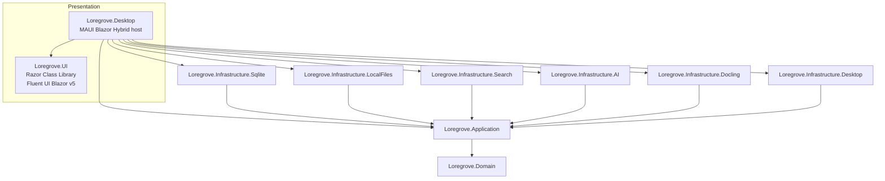
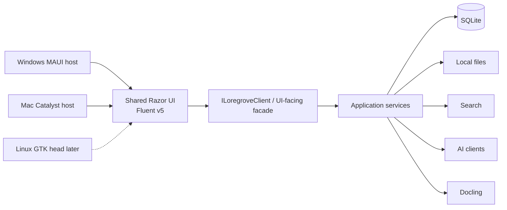
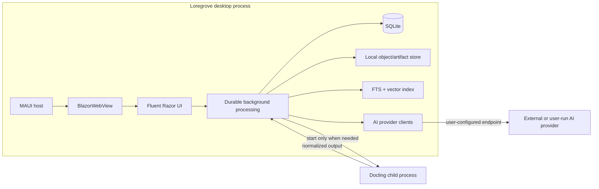
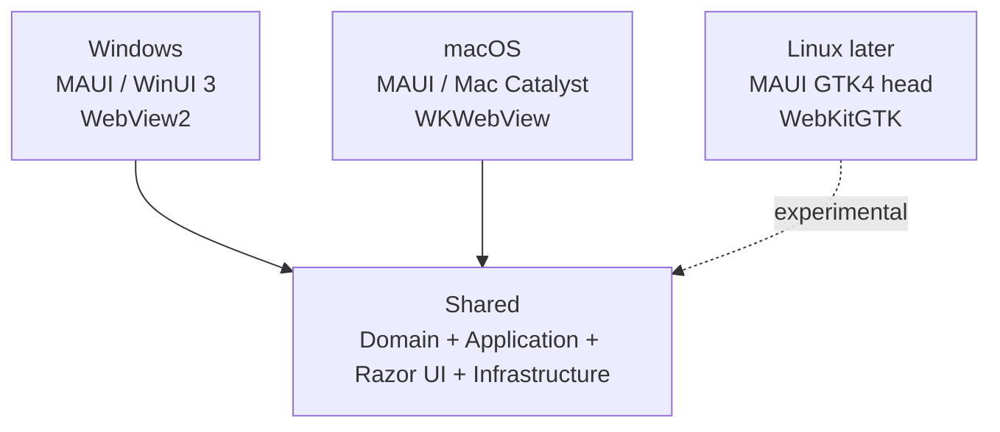

# Architecture

## Architectural style

Loregrove is a local modular monolith with Clean/Onion boundaries.

The desktop host is .NET MAUI Blazor Hybrid. MAUI owns platform hosting and OS integration. The primary application UI is shared Razor components styled with Fluent UI Blazor v5.



## Projects

```text
src/
  Loregrove.Domain/
  Loregrove.Application/

  Loregrove.UI/
  Loregrove.Desktop/

  Loregrove.Infrastructure.Sqlite/
  Loregrove.Infrastructure.LocalFiles/
  Loregrove.Infrastructure.Search/
  Loregrove.Infrastructure.AI/
  Loregrove.Infrastructure.Docling/
  Loregrove.Infrastructure.Desktop/

tests/
  Loregrove.UnitTests/
  Loregrove.ContractTests/
  Loregrove.IntegrationTests/
  Loregrove.UITests/
  Loregrove.EndToEndTests/
```

Post-MVP Linux adds a separate head:

```text
src/
  Loregrove.Desktop.Linux/
```

Do not invent a `net10.0-linux` MAUI TFM. The Linux head remains a separate project referencing shared application/UI code.

## UI boundary



Rules:

- Razor components do not use EF `DbContext`.
- Razor components do not open arbitrary files directly.
- Razor components do not start Docling.
- Razor components do not call provider SDKs directly.
- Platform-specific capabilities are injected through application/platform abstractions.
- Shared UI must not reference Windows, Mac Catalyst, GTK, WebView2, or WebKitGTK APIs.

## Runtime topology



There is no local ASP.NET server between the Blazor UI and application services.

## Platform topology



## Local library layout

```text
MyLoregrove/
  library.db
  objects/
    aa/
      <sha256>
  artifacts/
    <document-id>/
      <version-id>/
        normalized.json
        content.md
        previews/
  indexes/
    vector/
  backups/
  logs/
```

Original files are immutable content-addressed objects.

## Dependency rules

- Domain references nothing.
- Application references Domain.
- UI references Application-facing contracts/view models, never Infrastructure.
- Infrastructure references Application and reaches Domain only through Application-owned boundaries.
- Desktop composes UI + Infrastructure.
- Domain/Application do not reference MAUI, Razor, Fluent UI, EF Core, Docling DTOs, provider SDKs, SQLite, or direct OS APIs.
- Linux GTK packages exist only in the later Linux head/integration project.

## Architectural invariants

1. Source bytes are preserved before parsing/enrichment.
2. Generated artifacts are rebuildable.
3. Canonical knowledge is mutated only through audited change sets.
4. AI extraction creates candidates, not canonical facts.
5. User resolutions are durable and reversible.
6. Provider outages do not prevent source capture.
7. Docling failure does not corrupt source or prior knowledge.
8. Windows/macOS share the same primary Razor UI.
9. Linux support may be removed/delayed without changing shared Domain/Application/UI.
