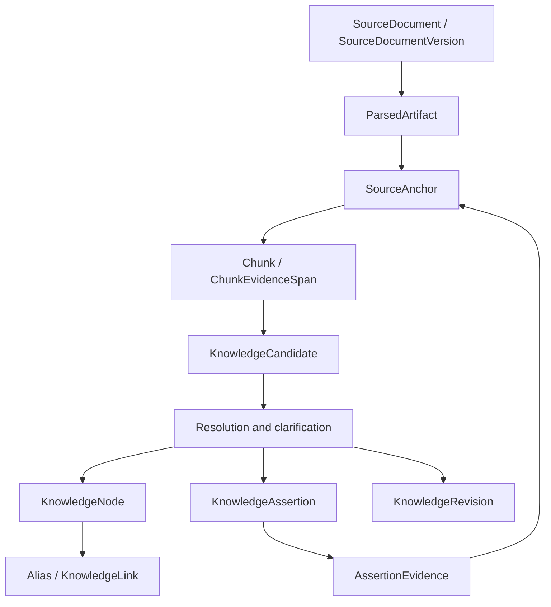
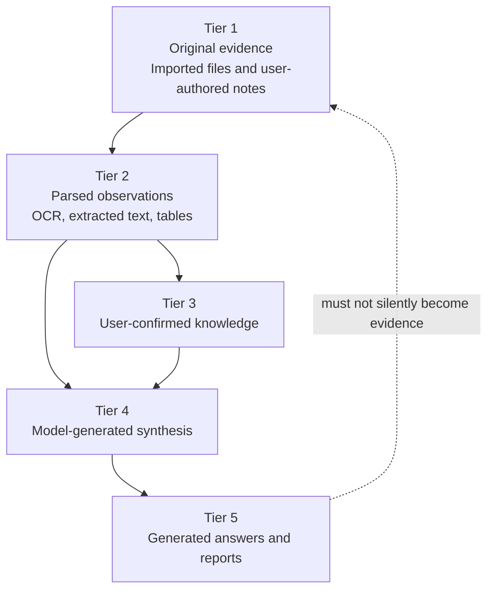

# Domain, Trust, and Provenance

## Knowledge layers

Source evidence remains authoritative even when derived knowledge is revised.

## Evidence layer

### SourceDocument
Logical identity of a source.

### SourceDocumentVersion
Immutable imported version with content hash, original filename, media type, size, object path, import time, previous version link, and processing state.

### SourceAnchor
Precise source location:
- PDF page + bounding box
- DOCX heading path + paragraph index
- XLSX sheet + cell/range
- image bounding region + OCR text
- Markdown heading/block

## Parsed layer

### ParsedArtifact
Rebuildable parser output with parser/version, type, path, hash, creation time.

### DocumentChunk
Retrieval unit linked to source version and anchors.

## Candidate layer

`KnowledgeCandidate` is interpretation, not truth.

Candidate types:
- Category
- Topic
- Entity
- Claim
- Relationship
- Date
- Event
- Decision
- DocumentVersionRelation

Each candidate stores evidence anchors, extraction run, and confidence signals.

## Canonical layer

### KnowledgeNode
Initial node types:
- Concept
- Person
- Organization
- Project
- Product
- Place
- Event
- Decision
- Topic
- Document
- Note

### Alias
Alternate label mapped to a canonical node, including whether user-confirmed.

### KnowledgeAssertion
Typed proposition:
- Subject node
- Predicate
- Object node or literal
- temporal validity
- status
- trust tier
- supersession link

### AssertionEvidence
Links assertions to source anchors as supports/contradicts/contextual.

### KnowledgeLink
Navigation relationship such as related-to, see-also, derived-from, mentions.

## Review and changes

### ClarificationTask
Stores question, involved candidates, uncertainty/impact signals, priority, status.

### UserResolution
Durable answer such as SameEntity, DifferentEntity, AliasMapping, PreferredCategory, DateInterpretation, VersionRelationship, AcceptAssertion, RejectAssertion.

### KnowledgeChangeSet
Atomic proposed operations: create/update/merge node, add alias, create/supersede assertion, add evidence/link, categorize source.

### KnowledgeRevision
Audit record of applied changes and reversal data.

## Trust tiers

1. Original evidence: imported files, user-authored notes.
2. Parsed observations: OCR, extracted text, tables, headings.
3. User-confirmed knowledge.
4. Model-generated synthesis: summaries, inferred links/categories.
5. Generated outputs: Q&A answers/reports.

Generated outputs never silently become source evidence.

## Trust hierarchy

## AI provenance

Record provider profile, model, prompt id/version, schema version, generation time, input hashes, relevant generation settings, and app version.

## Rules

- Source-derived canonical assertions require evidence anchors.
- Contradictory assertions may coexist.
- New information does not erase history.
- Merges, aliases, assertions, categories, and supersessions are reversible.
- Model self-reported confidence is insufficient; store component signals.
