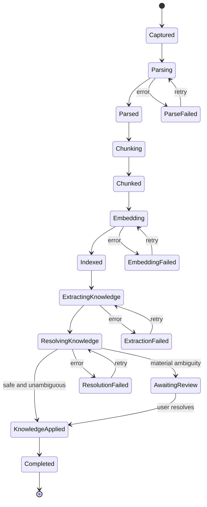
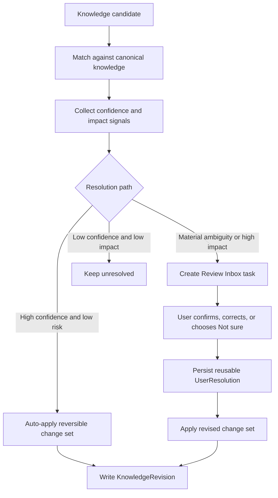

# Processing Pipeline and Clarification

## Pipeline

Failures are stage-specific and retain prior successful work.

## Capture

1. Stream SHA-256.
2. Copy source to content-addressed object store.
3. Create document/version.
4. Detect type/media type.
5. Create durable ProcessingJob.
6. Return to UI.

Exact duplicate bytes reuse the object.

## Parsing routing

- TXT/Markdown/simple HTML: in-process
- PDF/DOCX/PPTX/images: Docling
- XLSX: Docling plus workbook-specific structural reader

XLSX must preserve sheets, cell/range addresses, raw/display values, formulas, tables/merged ranges, and other useful structure rather than relying only on prose conversion.

## Chunking

Preserve source anchor(s), heading/context path, chunk hash, stable order.

## Embeddings

Cache by `(chunkContentHash, embeddingProfileFingerprint)`. Never mix different profile fingerprints or vector dimensions.

## Knowledge extraction

Structured-output schemas produce candidates only:
- summary
- categories/topics
- entities
- events/decisions
- claims/relations
- aliases
- possible document-version relationships

## Resolution

For each candidate:
1. search canonical nodes;
2. score likely matches;
3. apply user-confirmed rules;
4. evaluate uncertainty and impact;
5. propose KnowledgeChangeSet.

## Resolution decision flow

## Clarification strategy

Do not interrupt bulk imports with modals.

Three paths:
- high confidence + low risk -> auto-apply reversible change;
- material ambiguity/high impact -> Review Inbox;
- low confidence + low impact -> keep unresolved without bothering user.

Conceptual priority inputs:
- uncertainty
- downstream impact
- expected reuse
- user effort

High-impact questions include person/project merges, ambiguous dates affecting timelines, version relationships, and important contradictions.

Every review item must answer:
- Why am I being asked?
- What evidence supports each option?
- What changes if I choose it?
- Can I undo it?

User resolutions become inspectable/removable rules such as alias mappings, never-merge pairs, date locale, category mapping, or version naming patterns.

## Idempotency

Use content hashes, artifact hashes, chunk hashes, provider/model fingerprint, prompt version, and schema version so unchanged stages can reuse results.
