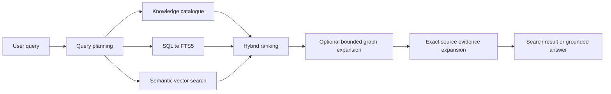
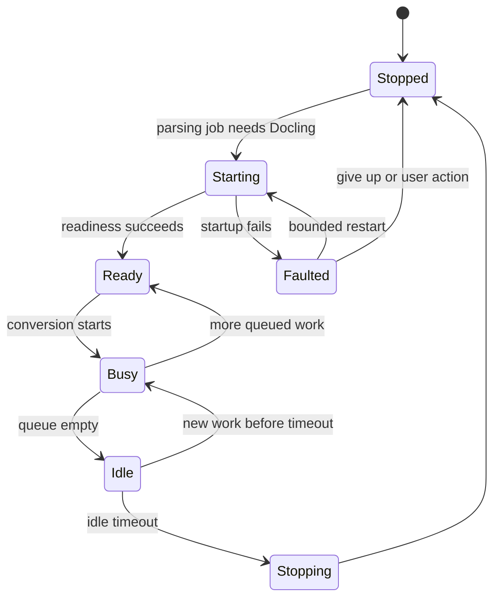

# Search, AI Providers, and Docling

## Retrieval layers

1. Knowledge catalogue: compact summaries, names, aliases, important assertions.
2. SQLite FTS5: exact names, phrases, codes, filenames, chunk/note content.
3. Semantic search: persisted embeddings + replaceable local `IVectorIndex`.
4. Graph traversal: bounded relationships/assertions/evidence.
5. Evidence expansion: exact source anchors for final context.

MVP vector strategy:
- vectors stored in SQLite as binary floats plus metadata;
- managed flat cosine index/cache;
- benchmark 1k/10k/50k/100k vectors;
- only adopt HNSW/native extension after evidence shows it is needed.

Search is a first-class screen and works without chat.

## AI provider rule

Loregrove never installs, downloads, starts, stops, or updates chat/embedding model processes.

Use separate profiles:
- EmbeddingProfile
- ChatProfile

Store base URL, provider kind, model, dimensions/settings, timeout, and a credential reference. API keys live in OS credential storage, not SQLite/logs.

Prefer `Microsoft.Extensions.AI` abstractions (`IChatClient`, `IEmbeddingGenerator`) with Loregrove-specific wrappers for validation, fingerprints, structured extraction, retries, privacy disclosure, and usage metadata.

Initial provider support:
- OpenAI
- Custom OpenAI-compatible endpoint
- Azure OpenAI only if it fits without distorting the abstraction

Changing chat model does not rebuild index. Changing embedding fingerprint marks the old vector index inactive/stale and schedules re-embedding.

## Privacy disclosure

Before remote processing, tell the user that document chunks may be sent to the embedding provider and excerpts may be sent to chat/extraction provider. The library is local; processing location depends on chosen providers.

## Docling modes

- Disabled
- ManagedLocal
- OneShot
- Remote

Default after optional processing pack is installed: ManagedLocal.

### Managed lifecycle

1. Compatible parsing job requests `EnsureReadyAsync()`.
2. Start Docling Serve on `127.0.0.1`, dynamic/configured port, UI disabled, local engine.
3. Poll readiness.
4. Convert queued document(s).
5. Reuse warm process for batch.
6. Stop after 3 minutes idle.
7. Graceful shutdown; force-kill process tree only as bounded recovery.

Initial constraints:
- exactly one Docling process
- one active conversion until stability is proven
- no Redis
- bounded startup/conversion timeouts
- remote URL fetching disabled by default where possible

### Packaging

Loregrove Core and Docling Processing Pack are separate installation/update units. Users do not manually install Python. Remote Docling is also supported.

## Presentation independence

Search, AI, and Docling services are application/infrastructure concerns. They do not depend on MAUI, Blazor, Fluent UI, WebView2, WKWebView, or GTK.

The same service implementations should behave identically regardless of the desktop host.
