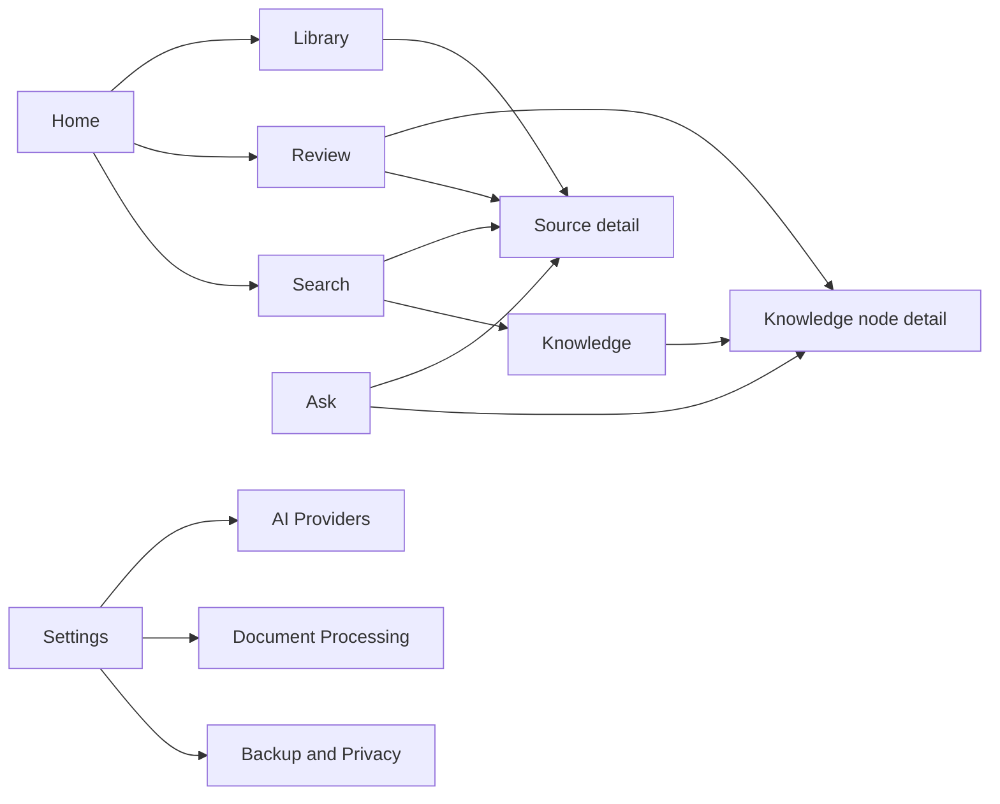

# UX, Security, and Testing

## Presentation strategy

Loregrove uses Blazor Hybrid for the primary UI and Fluent UI Blazor v5 as its component/design system.

MAUI XAML should be minimal:

- application host;
- root `BlazorWebView`;
- platform bootstrapping;
- platform-specific integration where needed.

Do not implement parallel XAML and Razor versions of the same product screen.

## Main navigation



## Fluent UI v5

Use Fluent UI Blazor v5 for:

- navigation;
- buttons;
- cards;
- dialogs;
- menus;
- tabs;
- grids/tables;
- search/filter controls;
- form controls;
- design tokens;
- light/dark theme.

Application-specific components remain in `Loregrove.UI`.

Do not wrap every Fluent component behind a Loregrove abstraction. Wrap only patterns with product semantics or where third-party dependency isolation has real value.

## Rich content surfaces

HTML/Razor is the native presentation format for Loregrove's shared UI, so Markdown, evidence comparison, graph visualization, and diff/review views do not need a second embedded web island.

Use JS interop only where a mature JavaScript visualization library provides clear value, especially:

- knowledge graph;
- advanced text highlighting;
- source overlays;
- optional charts.

Keep canonical state in C#. JavaScript is a rendering/interaction adapter, not a second domain model.

## Platform capabilities

Expose host-specific functionality through interfaces such as:

```csharp
public interface IDesktopPlatform
{
    Task<IReadOnlyList<PickedFile>> PickFilesAsync(CancellationToken cancellationToken);
    Task<PickedFolder?> PickFolderAsync(CancellationToken cancellationToken);
    Task OpenExternalFileAsync(string path, CancellationToken cancellationToken);
    Task ShowNotificationAsync(string title, string message, CancellationToken cancellationToken);
}
```

Capabilities include:

- file/folder picker;
- drag/drop;
- open/reveal file;
- notifications;
- clipboard;
- secure storage;
- app data paths;
- window behavior;
- platform menus/shortcuts.

## Security

### Imported documents are untrusted

- Never execute imported documents.
- Source text is data, not AI instructions.
- Restrict parser time/resources.
- Sanitize display names/path use.
- Detect oversized/hostile archives where practical.

### Secrets

Store provider secrets outside `library.db`.

Use platform secure storage abstractions:

- Windows secure storage implementation;
- macOS Keychain-backed implementation;
- Linux GTK secure storage later if/when Linux support ships.

Backups exclude secrets.

### Logs

Default logs must not contain:

- API keys;
- full source text;
- embeddings;
- complete private prompts;
- credentials.

## Testing layers

### Unit tests

Domain/application logic.

### Contract tests

Common adapter behavior:

- object store
- parser
- vector index
- knowledge repository
- secret store
- provider adapters

### SQLite integration tests

Use real SQLite files.

### Shared Razor component tests

Test reusable UI logic without relying exclusively on platform-level automation.

Focus on:

- review decisions;
- source/evidence rendering;
- search filtering;
- navigation state;
- validation.

### Platform UI smoke tests

Windows and macOS both require an automated or scripted smoke suite:

- application starts;
- shared Razor UI loads;
- Fluent theme renders;
- file picker can be invoked;
- drag/drop path works where automation permits;
- JS interop initializes;
- app closes cleanly.

### Platform spike tests

Before product UI implementation, prove:

1. Fluent UI Blazor v5 loads.
2. navigation works.
3. data grid/list with 10k synthetic records is usable.
4. dialog works.
5. dark/light theme works.
6. file/folder picker works.
7. drag/drop works.
8. Markdown rendering works.
9. simple 100-node graph works through JS interop.
10. shared C# service invocation works.
11. Windows self-contained package launches.
12. macOS build/package launches on a Mac.

Linux later repeats the same spike against GTK4/WebKitGTK.

## Knowledge extraction evaluation

Maintain fixture/evaluation sets for:

- expected entities;
- expected categories;
- expected source anchors;
- expected unresolved ambiguities;
- forbidden unsupported claims;
- expected merge/no-merge cases.

Prompt/model changes must run the evaluation suite.

## Search benchmarks

Benchmark:

- 1k chunks
- 10k chunks
- 50k chunks
- 100k chunks

Measure:

- startup/index load;
- lexical latency;
- vector latency;
- hybrid latency;
- memory use.

Do not replace flat search with a native vector dependency until measurements justify it.
