# Roadmap and OpenRAG Reuse

## Milestones

```mermaid
flowchart LR
    P0["0<br/>Platform spike"] --> P1["1<br/>Repo + architecture"]
    P1 --> P2["2<br/>Evidence foundation"]
    P2 --> P3["3<br/>Document processing"]
    P3 --> P4["4<br/>Search"]
    P4 --> P5["5<br/>Knowledge compiler"]
    P5 --> P6["6<br/>Resolution + Review"]
    P6 --> P7["7<br/>Knowledge browser"]
    P7 --> P8["8<br/>Grounded Ask"]
    P8 --> P9["9<br/>Health + reflection"]
    P9 --> P10["10<br/>Backup + Win/macOS MVP"]
    P10 -. post-MVP .-> P11["11<br/>Linux GTK preview"]
```

## Milestone 0 — Platform spike

Prove MAUI Blazor Hybrid + Fluent UI Blazor v5 on:

- Windows;
- macOS.

Do not build product infrastructure until the spike passes.

Gate criteria are defined in `codex/00_PLATFORM_SPIKE.md`.

## Milestone 1 — Repository and architecture

- solution
- project boundaries
- CI
- architecture tests
- shared Razor UI project
- MAUI desktop host
- platform capability abstractions

## Milestone 2 — Evidence foundation

- SQLite
- object store
- source versions
- durable processing jobs
- text/Markdown import
- Library UI

## Milestone 3 — Document processing

- Docling supervisor
- PDF/DOCX/PPTX/image processing
- XLSX structural metadata
- source anchors
- parsing diagnostics

## Milestone 4 — Search

- chunking
- FTS5
- AI provider config
- embeddings
- managed vector search
- hybrid Search UI

## Milestone 5 — Knowledge compiler

- extraction schemas
- candidates
- categories/topics/entities/claims/relations
- provenance
- proposed change sets

## Milestone 6 — Resolution and Review

- entity matching
- aliases
- confidence/impact signals
- clarification tasks
- reusable user resolutions
- reversible changes

This is Loregrove's principal differentiation.

## Milestone 7 — Knowledge browser

- canonical node pages
- assertions
- evidence
- relationships
- contradictions
- revision history
- user notes

## Milestone 8 — Evidence-grounded Ask

- hybrid retrieval
- graph expansion
- source citations
- evidence panel
- generated-artifact trust tier

## Milestone 9 — Knowledge health and reflection

- duplicates
- unsupported assertions
- orphan nodes
- contradictions
- broken evidence
- stale artifacts
- suggested synthesis

## Milestone 10 — MVP release

- backup/restore
- Windows packaging
- macOS packaging/signing/notarization path
- release CI
- migration safety
- diagnostics
- performance validation

## Milestone 11 — Linux preview

Only after MVP.

Evaluate current `dotnet/maui-labs` GTK4 status again before implementation.

If viable:

- separate Linux head project;
- WebKitGTK BlazorWebView;
- GTK platform capabilities;
- Linux packaging;
- same shared Razor/Fluent UI.

If not viable, Linux remains deferred without disturbing the core architecture.

## Selective reuse from OpenRAG

### Reuse/adapt

- document/version concepts
- hashing/dedup
- Markdown chunking
- Docling-aware chunking ideas
- citation/evidence models
- embedding compatibility checks
- OpenAI-compatible provider behavior
- ingestion stage concepts
- retrieval diagnostics
- relevant tests

### Do not port

- tenants
- PostgreSQL/Npgsql
- pgvector persistence
- CAP
- S3
- API/Worker topology
- RabbitMQ/Kafka/Azure Service Bus
- Kubernetes
- distributed locks
- server-only health/deployment topology

## Shared package extraction

Do not create shared OpenRAG/Loregrove packages at repository creation.

First let Loregrove stabilize. Extract packages only after both products demonstrate a genuinely stable common boundary.
