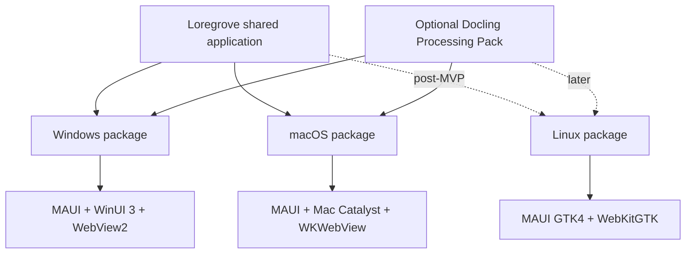

# Release and Platform Decisions

## Accepted decisions

| Area | Decision |
|---|---|
| Product | Loregrove |
| Repository | New repository |
| Runtime | .NET 10 |
| Desktop host | .NET MAUI Blazor Hybrid |
| Primary UI | Razor Class Library + Fluent UI Blazor v5 |
| Windows | MAUI + WinUI 3 + WebView2 |
| macOS | MAUI + Mac Catalyst + WKWebView |
| Linux | Later separate MAUI GTK4 head; experimental |
| Database | SQLite |
| Lexical search | SQLite FTS5 |
| Vector MVP | Managed flat index |
| Source storage | Content-addressed local filesystem |
| AI | User-configured providers |
| Doc processing | On-demand Docling |
| Docs diagrams | Mermaid |
| Cloud/web version | Not planned |
| Mobile | Not MVP |

## Platform policy

Windows and macOS are first-class supported desktop targets for MVP.

Linux must not be claimed as supported until a post-MVP GTK validation gate passes.

The Linux backend is experimental and may change independently of official MAUI support. Therefore:

- no Linux dependencies in shared projects;
- no Linux-specific code branches in shared Razor components unless unavoidable;
- no release commitment before testing;
- Linux failure must never block Windows/macOS releases.

## Packaging

## Windows release

Target:

- self-contained;
- no separately installed .NET runtime;
- installer without Docker/PostgreSQL;
- WebView2 runtime prerequisite handled according to current Microsoft packaging guidance;
- signing as a release pipeline input.

## macOS release

Target:

- Mac Catalyst app;
- signing;
- notarization;
- packaging suitable for normal installation;
- Keychain-backed secret storage;
- required entitlements minimized.

A Mac build agent is required for macOS build/sign/package validation.

## Docling pack

Keep Loregrove Core independent of the local Docling runtime.

Users must still be able to:

- launch;
- create a library;
- import simple text/Markdown;
- browse;
- use other non-Docling features

without installing the Docling pack.

## Updates

Do not build silent auto-update in the initial MVP.

Require:

- version display;
- migration safety;
- changelog;
- backup recommendation/pre-migration backup for risky schema changes.

## Portable backup

Include:

- `library.db`;
- original source objects;
- parsed artifacts;
- manifest;
- optional rebuildable indexes.

Exclude:

- provider secrets;
- volatile logs.
