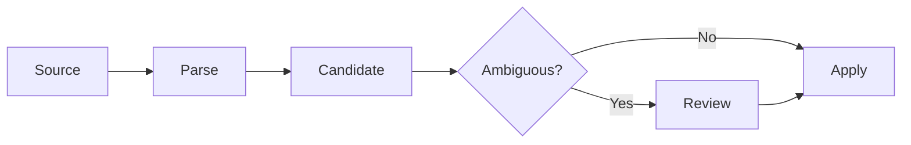

# Documentation Style

## Mermaid diagrams

Use GitHub-compatible Mermaid for architecture, workflows, state machines, dependency diagrams, and important decision flows.

Preferred diagram types:
- `flowchart` for architecture and data flow
- `stateDiagram-v2` for lifecycle/state transitions
- `sequenceDiagram` for interactions
- `erDiagram` when a relational view is clearer than prose

Example:

## Do not use ASCII diagrams

Architecture and process documentation must not use character-art boxes or arrows.

Plain fenced code blocks remain appropriate for literal content:
- repository directory trees
- file-system layouts
- commands
- JSON/YAML/XML
- source code
- SQL
- schemas meant to be copied verbatim

## Diagram rules

1. Keep node labels short.
2. Prefer one diagram per concept.
3. Do not encode every implementation class in a high-level architecture diagram.
4. Diagrams must agree with the surrounding prose.
5. Avoid custom colors/themes so GitHub light/dark rendering stays readable.
6. Use ` ` for short multi-line labels.
7. Re-check Mermaid syntax when labels contain punctuation.
