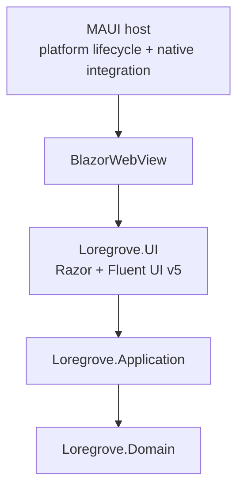
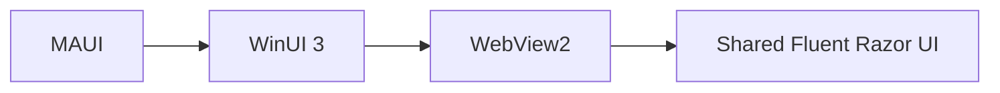
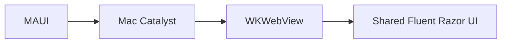
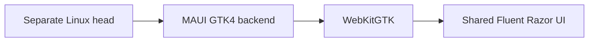

# Desktop Platform and UI Architecture

## Decision

Loregrove uses:

> .NET 10 + .NET MAUI Blazor Hybrid + Fluent UI Blazor v5.

Windows and macOS are first-class. Linux is a later experimental GTK4 head.

## Why this architecture

Loregrove is dominated by information-rich surfaces:

- document lists;
- evidence views;
- review cards;
- Markdown;
- diff/merge views;
- graph visualization;
- search result composition;
- assistant answers with citations.

Razor + HTML/CSS + Fluent components suit those surfaces well and allow one primary UI implementation across all intended desktop hosts.

## Layer responsibilities

### MAUI host owns

- application lifecycle;
- window creation;
- WebView hosting;
- native file/folder selection;
- drag/drop adaptation;
- native notifications;
- secure storage;
- platform paths;
- platform menus/shortcuts where needed;
- packaging hooks.

### Shared Razor UI owns

- Home;
- Library;
- Search;
- Knowledge;
- Review;
- Ask;
- Settings;
- source/evidence rendering;
- Markdown;
- diff/review;
- graph;
- theme;
- application navigation.

## Windows

## macOS

## Linux later

Linux is intentionally a head project rather than a target framework added to the official multi-targeted MAUI project.

## No local web server

Blazor Hybrid runs in the local app process.

Do not add:

- localhost ASP.NET server;
- REST between desktop UI and Application;
- Electron;
- Node runtime;
- WASM;
- duplicated TypeScript domain layer.

## UI dependency rule

`Loregrove.UI` may depend on:

- Razor/Blazor;
- Fluent UI Blazor v5;
- UI-facing contracts/view models;
- carefully selected JS visualization packages/assets.

It may not depend on:

- EF Core;
- SQLite;
- Docling SDK DTOs;
- provider SDK DTOs;
- Windows APIs;
- Mac Catalyst APIs;
- GTK APIs.

## Theme

Use Fluent design tokens.

Support:

- light;
- dark;
- follow-system.

Platform host should notify the shared UI when system appearance changes where practical.

## Performance

The platform spike must validate:

- 10k synthetic result rows;
- large search result navigation;
- graph interop;
- Markdown;
- repeated review-card rendering;
- no unnecessary full-page rerenders;
- memory behavior on both Windows and macOS.

Use virtualization/paging when justified.

## Accessibility

Treat keyboard navigation and accessibility as MVP requirements.

- logical tab order;
- visible focus;
- semantic labels;
- screen-reader friendly controls;
- accessible review decisions;
- sufficient contrast;
- no information encoded only by color.
