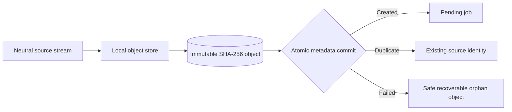

# ADR-008: Content-addressed source capture

Status: Accepted

## Context

Original evidence must survive parser, provider, database, and process failures. Imported filenames
are untrusted, identical bytes should not consume duplicate space, and object files cannot participate
in the future SQLite metadata transaction.

## Decision

Store original bytes as immutable local objects addressed by the lowercase SHA-256 hash of the
complete stream. The portable object key is `<hash[0..2]>/<hash>`. Write into a unique temporary file,
flush and close it, then move it to the final path without overwrite.

The Application layer owns `IObjectStore`, `ILibraryPaths`, and the EF Core transaction orchestration.
`Loregrove.Infrastructure.LocalFiles` owns path translation and filesystem atomicity. Metadata
persistence atomically deduplicates by content hash and commits the document, version, and pending job
together only after the object is finalized. Infrastructure.Sqlite implements the Application-facing
DbContext and provider-specific uniqueness translation.

## Consequences

- Filenames cannot influence storage paths.
- Exact duplicates converge at both the filesystem and metadata boundaries.
- Large files can be captured without whole-file buffering or seeking.
- Concurrent identical writes require no process-global lock.
- Cancellation before finalization leaves no partial final object.
- A metadata failure may leave an immutable orphan for later garbage collection.
- SHA-256 is part of the durable object-key contract; changing it requires a migration decision.
