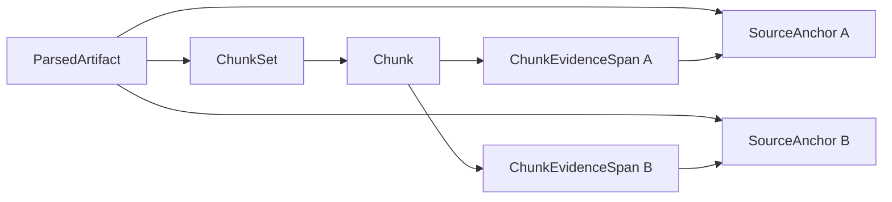
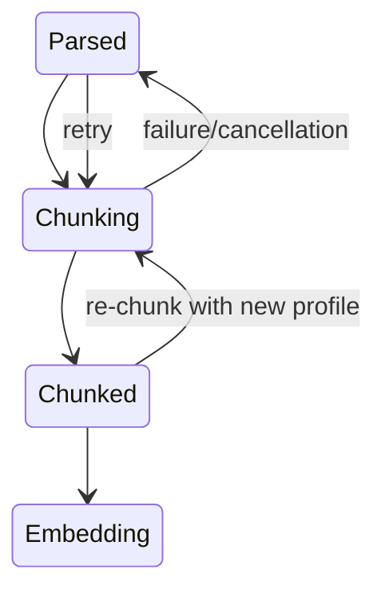
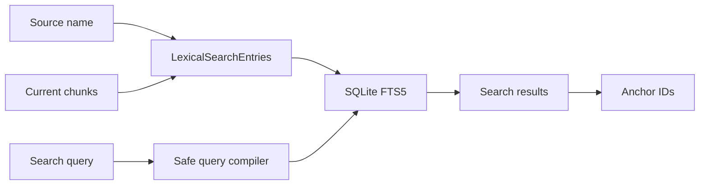

# Chunking and lexical search

Loregrove derives bounded retrieval units from current Tier-2 parsed evidence and indexes only the
current derivation in local SQLite FTS5. A chunk is not evidence and is not canonical knowledge. It
can always be traced through exact half-open evidence spans to the immutable source chain.



## Chunker profile and integrity

`IChunker` receives a normalized `ChunkingDocument`; it never opens files, uses EF, calls Docling,
or depends on SQLite, UI, or AI. `ChunkingDocumentReader` opens the immutable current parsed artifact
and validates its SHA-256, source version/hash, block count, unique contiguous ordinals, text, text
hash, and relational anchor identity before returning heading paths and typed locators.

The production `EvidenceAwareChunker` profile is:

```text
Id = loregrove.evidence-aware
Version = 1.0.0
SchemaVersion = 1
TargetCharacters = 1200
MaximumCharacters = 2000
MinimumCharacters = 200
OverlapCharacters = 0
Separator = LF LF
```

Configuration and chunker fingerprints are lowercase SHA-256 over every listed output-affecting
option plus chunker identity/version/schema. Sizing is character-based and deterministic; no
provider tokenizer is present. Heading changes form boundaries. Small tables, code, formulae, and
headings stay atomic. Oversized observations split in newline, sentence-like, whitespace, then hard
character order without gaps, overlap, truncation, discarded whitespace, or bisected UTF-16
surrogate pairs.

## Chunk content and identity

`Text` contains only source-derived body text. `ContextText` contains the normalized heading path,
joined with ` › `. Context separators are metadata and do not receive evidence spans.

```text
CanonicalContent = Text                                  when ContextText is empty
CanonicalContent = ContextText + LF LF + Text            otherwise
ContentHash = SHA256(UTF8(CanonicalContent))

ChunkKey = SHA256(
    SourceContentHash +
    ParsedArtifactContentHash +
    ChunkerFingerprint +
    ChunkOrdinal +
    ContentHash +
    ordered(anchor ordinal, anchor text hash, locator fingerprint,
            anchor offsets, chunk offsets))
```

`ChunkEvidenceSpan` stores chunk, anchor, artifact, and version identity, ordinal, `AnchorStart`,
`AnchorEnd`, `ChunkStart`, and `ChunkEnd`. Starts are inclusive and ends exclusive. The `\n\n`
separator between observations is intentionally not evidence. A split observation produces
contiguous anchor ranges across chunks; a multi-anchor chunk produces one range per anchor.

## History, persistence, and processing

`ChunkSet` is immutable derivation history. `(ParsedArtifactId, ChunkerFingerprint)` is idempotent,
and a partial unique index permits one current set per source version. A new parser artifact or
chunker fingerprint creates a new current set while preserving historical sets, chunks, and spans.
Composite alternate keys and foreign keys require a chunk, its set, and every referenced anchor to
share the same artifact and source version. CHECK constraints validate all ranges.

Chunk generation occurs in memory. One SQLite transaction switches the current set, inserts the
set, chunks, and spans, replaces relational lexical entries, advances the source/job, and lets FTS
triggers update the virtual table. Failure rolls back all derived rows. A controlled failure returns
the source to Parsed and records Failed/Chunking; cancellation returns Pending/Chunking without
erasing the consumed real attempt. Startup recovery performs the same reset for an interrupted claim.
Before the transaction starts, the application validates plugin chunker output against the input
observations: ordinals and identities, canonical hashes and keys, exact source slices, separator-only
unmapped text, bounds, ordering, and gap/overlap-free coverage must all agree.

`RechunkAsync` is the explicit profile-change transition. It claims a source already at
Chunked/Pending/Embedding only when the requested fingerprint differs from the current set, then
atomically promotes the new derivation and leaves the previous set as immutable history. Calling it
with the current fingerprint is idempotent and returns the existing set.



Job state distinguishes Failed from Pending when the source returns to its last successful Parsed
state. Success ends at Source=Chunked and Job=Pending/Embedding; Prompt 10 owns Embedding.

## SQLite FTS5 projection



`LexicalSearchEntries` is the durable, rebuildable content table. It has one filename-only Source
entry per searchable version and one Chunk entry per current chunk. Historical chunks have no active
entry. The external-content virtual table is equivalent to:

```sql
CREATE VIRTUAL TABLE LexicalSearchFts USING fts5(
    Title,
    Heading,
    Body,
    content='LexicalSearchEntries',
    content_rowid='RowId',
    tokenize='unicode61 remove_diacritics 2'
);
```

Insert, update, and delete triggers synchronize FTS transactionally. Rebuild executes the FTS5
`rebuild` command against the relational content table and needs no parsing or chunking. Startup
probes the virtual table and fails with a controlled capability message if FTS5 is unavailable.

## Query behavior and UI

`FtsQueryCompiler` extracts at most 32 Unicode literal terms from at most 500 characters and quotes
each term. Operators, quotes, wildcards, punctuation, and parentheses never enter FTS grammar.
Whitespace-separated terms use AND semantics. Results use database paging (25 by default), weighted
`bm25(Title=8, Heading=4, Body=1)`, and RowId as a deterministic tie-breaker. FTS produces a bounded
24-token plain-text snippet with no markup. Anchor IDs for a page are loaded in one batch query.

The shared Fluent Search screen uses `FluentTextInput` with a 300 ms delay, Fluent cards, badges,
buttons, spinner, and message bar, semantic result/navigation elements, and `LatestRequestRunner`.
Changing query/page cancels the obsolete request and only the newest request may publish loading,
result, or error state. Every result navigates to the existing Source Details route while retaining
chunk and anchor identities for later exact preview/citation support.

This design requires no embedding generator, chat client, model runtime, network endpoint, or
Docling process at search time. Prompt 10 can compose stable target identities with vector results
without changing provenance or the canonical content hash.
