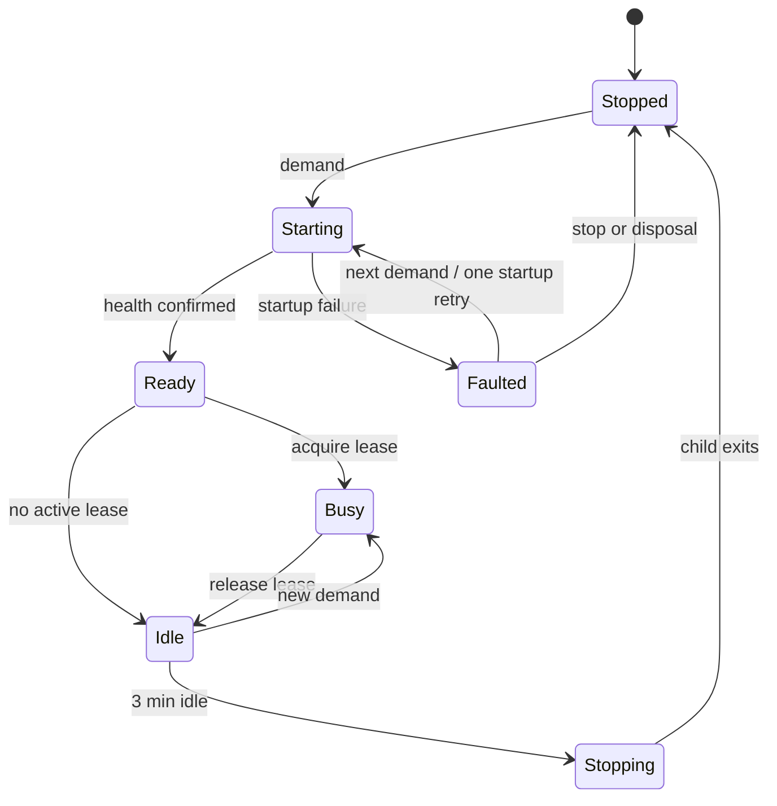
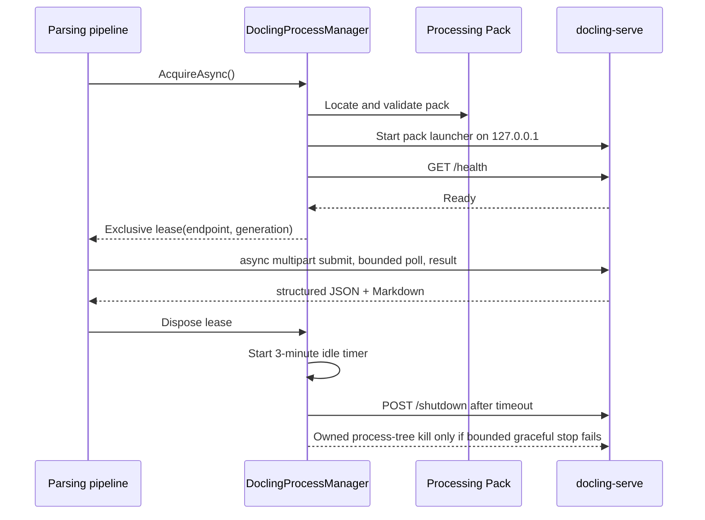

# Managed Docling supervisor

## Boundary

Loregrove manages Docling because document conversion is part of the document-processing subsystem.
This exception does not extend to AI runtimes: Loregrove never installs, downloads, starts, stops, or
updates chat or embedding model processes. The implementation is deliberately named for Docling and
does not provide a general Python, model, or arbitrary-process manager.

Prompt 06 established lifecycle and packaging infrastructure. Prompt 07 registers the complex-format
Docling parser, acquires its lease in ManagedLocal mode, and maps conversion output through the
parsing/evidence boundary established by Prompt 05. Conversion behavior is specified in
[Docling conversion and complex-format anchors](docling-conversion.md).

## Modes

| Mode | Local reusable process behavior |
|---|---|
| `Disabled` | Conversion availability defers before a parsing claim; no process starts. |
| `ManagedLocal` | One private Processing Pack process starts on demand and is reused. |
| `OneShot` | Conversion availability defers; this supervisor does not start a process. |
| `Remote` | The converter calls the configured endpoint; this supervisor never starts a local process. |

There is no fallback between modes. In particular, `Remote` and `Disabled` cannot silently become
`ManagedLocal`.

## Processing Pack

The optional Docling Processing Pack is an application/runtime unit, separate from both the
Loregrove executable and the user's library:

```text
<application base>/
  processing-packs/
    docling/
      <runtime identifier>/
        manifest.json
        bin/<pack launcher>
        runtime/<private Python and native runtime>
        assets/<redistributable pinned assets>

<user library>/
  library.db
  objects/
  artifacts/
```

Library backup therefore cannot include the pack. Users do not install Python, create a virtual
environment, configure `PATH`, or run `pip`. Normal Loregrove execution never installs or downloads
runtime components.

The schema-1 manifest contains:

- `schemaVersion` and `commandContractVersion`;
- `packVersion`;
- `pythonVersion`, `doclingVersion`, and `doclingServeVersion`;
- `runtimeIdentifier`;
- a relative `entryPoint`;
- relative `requiredFiles`.

No manifest path may be absolute or escape the pack root. Supported release identifiers are
`win-x64`, `osx-x64`, and `osx-arm64`. Pack identity is the tuple of manifest schema, command
contract, pack version, runtime identifier, Docling version, and docling-serve version.

The deterministic lookup order is:

1. explicit developer/test override (`LOREGROVE_DOCLING_PACK` in the desktop composition root);
2. `<application base>/processing-packs/docling/<current runtime identifier>`;
3. no pack.

An explicit but missing override does not fall through. The locator never checks `PATH` for
`python`, `python3`, `docling`, or `docling-serve`.

Validation is read-only and occurs before process launch. It checks manifest presence and strict
JSON shape, supported schema/command contract/runtime, sane bounded version fields, relative paths,
the entry point, and every declared required file. It reports present, missing, incompatible, or
corrupt through `IDoclingPackInspector` without starting a process or hashing a multi-gigabyte pack.
Deep checksum verification can be an explicit future operation.

## Pack launcher contract

The manifest entry point is a Processing Pack launcher, not an arbitrary raw Python command.
Launcher contract v1 receives arguments using `ProcessStartInfo.ArgumentList`:

```text
--host 127.0.0.1
--port <selected port>
--disable-ui
--local-files-only
```

The pack build owns translation from this stable contract to the exact command interface of its
pinned docling-serve version. This keeps raw upstream switches centralized in packaging and avoids
guessing or scattering them through the supervisor. No shell is involved.

## Ownership and state

`IDoclingProcessManager` exposes readiness, exclusive acquisition, idempotent stop, and an immutable
status snapshot. It is registered once as a singleton. Internally, ownership includes the concrete
process handle, PID, monotonic generation ID, loopback endpoint, start time, and pack version. Exit
callbacks compare the generation before changing state, so an old process cannot fault a replacement.

States have these meanings:

- `Stopped`: no owned child exists;
- `Starting`: the child was launched but readiness is not confirmed;
- `Ready`: health was confirmed; this is a short transition before acquisition or idle scheduling;
- `Busy`: one valid conversion lease is active;
- `Idle`: the child is healthy, no lease is active, and idle shutdown is scheduled;
- `Stopping`: no endpoint is issued while bounded shutdown runs;
- `Faulted`: pack/startup/exit/shutdown failed in a controlled way.



One lifecycle coordinator owns transitions behind a narrow asynchronous `SemaphoreSlim`. Concurrent
callers share one manager-owned startup task. A caller cancels only its wait; it cannot cancel the
startup needed by other callers. There are no global locks, blocking sleeps, or busy polling.

Exactly one child is owned and exactly one `IDoclingProcessLease` is active. The lease semaphore is
independent of lifecycle synchronization. Cancellation while waiting does not release another
caller's lease. Disposing a lease once moves its live generation from `Busy` to `Idle`; repeated
disposal is harmless. A process exit invalidates its outstanding lease, and Prompt 07 must decide
conversion retry semantics rather than continuing against a replacement endpoint.

## Port and readiness

The default port allocator briefly reserves an OS-assigned port on `127.0.0.1`, releases the
reservation, and launches the pack. A configured nonzero port is available for development
diagnostics. The endpoint is always constructed as `http://127.0.0.1:<port>/`; hostnames, wildcard
addresses, LAN addresses, proxies, and HTTP redirects are not accepted by the managed control path.

The release-before-launch step has an unavoidable bind race. The two-attempt startup budget selects
a fresh dynamic port for the retry. It never searches indefinitely.

Readiness is a real HTTP `GET /health` against the private endpoint. Process existence is not
readiness. Polls have per-probe timeouts, a bounded interval, and an overall startup timeout. The
loop stops immediately on child exit, manager stop, or timeout. Production defaults are two minutes
for startup, two seconds per probe, and 250 milliseconds between probes; tests inject milliseconds.

## Warm reuse, failure, and shutdown

After final lease release, the manager schedules the three-minute default idle timeout. New demand
cancels that generation's countdown and reuses it. If timeout wins first, new work observes
`Stopping`, waits for the bounded stop, and starts one clean replacement. It never receives an
endpoint being terminated.

A startup sequence performs at most two launches: the initial attempt plus exactly one automatic
retry. Each dynamic attempt gets a new port. Two failures end in `Faulted`; there is no background
restart loop. An unexpected exit in `Ready`, `Busy`, or `Idle` also becomes `Faulted`. Recovery is
demand-driven, and an idle crash never auto-restarts.

Shutdown is ordered:

1. enter `Stopping`, cancel readiness and idle work, and stop issuing endpoints;
2. request `POST /shutdown` through Processing Pack launcher contract v1;
3. wait the bounded graceful period;
4. if needed, call `Kill(entireProcessTree: true)` on the owned handle only;
5. wait the bounded forced period and dispose handles;
6. enter `Stopped`, or `Faulted/ShutdownFailed` if exit cannot be confirmed.

The implementation never scans or kills by executable name. Singleton synchronous or asynchronous
disposal runs the same bounded shutdown sequence when the desktop service provider is disposed, so
normal MAUI host shutdown does not intentionally leave the child running. If even the owned-tree kill
cannot confirm exit, the manager retains that generation as owned and refuses to launch a replacement;
a later stop/demand retries bounded cleanup instead of creating two children.

## Diagnostics and privacy

Standard output and error are drained asynchronously immediately after launch. Each stream retains
only its most recent 32 Ki characters (approximately 128 KiB of UTF-16 character storage combined),
preventing pipe deadlock and unbounded memory growth. Raw output remains internal failure-investigation data. Public snapshots expose only
typed failure codes and safe operational metadata; they do not expose a `Process`, raw output,
command line, environment, full paths, document content, or stack traces. Normal logging must not
persist raw Docling output.

Typed failure categories are `PackMissing`, `PackInvalid`, `UnsupportedRuntime`,
`ProcessLaunchFailed`, `ReadinessTimeout`, `ProcessExited`, `ShutdownFailed`, and `PortUnavailable`,
plus explicit mode failures. Application consumers never parse text to identify failure type.

## Conversion integration



The complex-format parser connects the lease endpoint to pinned Docling output and maps it into
`ParsedDocumentResult`, `ParsedArtifact`, and `SourceAnchor`. It preserves the immutable source and
evidence rules and does not add remote URL fetching to local conversion.
