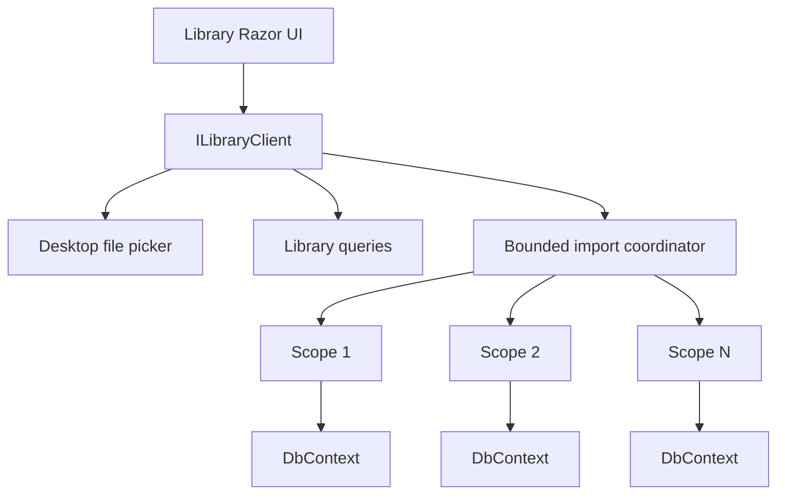
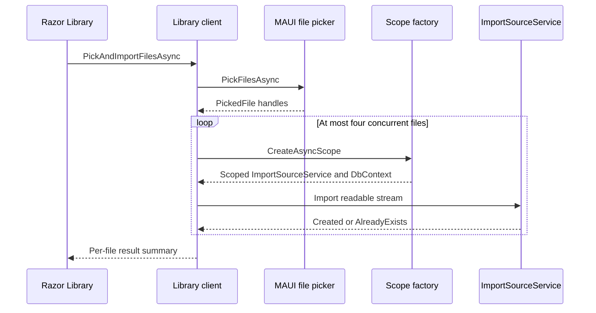
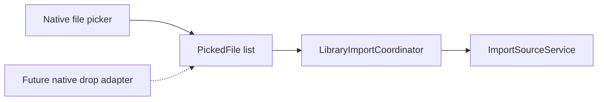

# Library UI and source import

Prompt 04 turns the durable capture and SQLite foundation into Loregrove's first complete desktop
workflow: select local files, capture them, query the durable library, and inspect source metadata.
TXT and Markdown parsing now run through a separate durable Application use case after capture.
Complex formats remain pending for the later Docling path.

## Boundaries

The shared Razor screen depends only on `ILoregroveClient.Library` and UI-facing records. It does not
resolve a DbContext, construct dependency-injection scopes, open source streams, or call MAUI APIs.
The Application facade owns use-case scopes; the MAUI host supplies the native file picker.

`LibraryQueryService` is scoped and uses provider-neutral EF Core APIs through
`ILoregroveDbContext`. Queries use `AsNoTracking`, project into immutable UI-facing models, and join
the current version through `SourceDocument.CurrentVersionId` without changing the Prompt 03
version model. SQLite provider types remain isolated in `Infrastructure.Sqlite`.

## Picker and source lifetime

MAUI's multi-file picker returns `FileResult` instances on Windows and Mac Catalyst. The desktop
adapter converts each result to a neutral `PickedFile` containing display metadata and an
`OpenReadAsync` delegate. No persistent local path crosses into Application or Razor. This shape
allows the adapter to preserve platform access semantics, including future macOS security-scoped
URL or bookmark work.

The coordinator opens one source stream inside its file operation and deterministically disposes it
after `ImportSourceService` finishes or fails. Streams are not assumed to be seekable. Original
filenames remain untrusted presentation metadata and never form object-store paths.

## Concurrency, progress, and failure

The coordinator reports `Queued`, `Importing`, `Imported`, `AlreadyExists`, `Failed`, and `Cancelled`
states. A semaphore bounds active imports to four. Every admitted item creates its own async DI scope,
so concurrent work never shares an `ImportSourceService` or `LoregroveDbContext`.

Cancellation reaches both queued and active work. Completed captures remain committed, while Prompt
03's safe finalized-object orphan semantics still apply to cancellation during relational capture.
Exceptions are translated into short safe messages; one failed file does not abort unrelated files.
An exact byte duplicate is presented quietly as “Already in library,” not as an error.

## Query and refresh model

Library reads are bounded to page sizes 25, 50, or 100 and default to 50. Results order by UTC import
time descending and document ID descending for deterministic ties. The initial text filter matches
display name and original filename through an escaped SQL `LIKE`; this is deliberately not FTS.
Fluent's immediate input delay debounces filtering by 325 milliseconds, and a new load cancels the
stale query.

After an import batch finishes, the UI queries SQLite again instead of appending assumed rows. SQLite
therefore remains the only library source of truth, and the same rows are returned when services and
the application restart.

### 10,000-row query observation

A local Release integration run on 2026-08-12 seeded 10,000 source/version metadata pairs into real
SQLite and measured the bounded queries after seeding:

| Operation | Observed time |
| --- | ---: |
| First page, 100 rows | 170.5 ms |
| Filename filter, 1 matching row | 80.5 ms |

These are qualitative development-machine observations rather than performance thresholds. The test
prints fresh timings on every run and asserts bounded results and filter correctness, not wall-clock
speed. Visible Fluent grid interaction still requires platform runtime validation.

## Shared UI

The Fluent UI v5 Library surface includes loading, empty, error, import-progress, and paged-data-grid
states. Rows navigate to a shared Razor detail route showing trusted metadata labels plus expandable
hash and identifier details. Status text accompanies its visual badge, and import outcomes are
announced through live regions.

Application widgets follow the repository's Fluent-first rule: row navigation uses the pinned v5
package's `FluentAnchorButton`, the search input uses `FluentTextInput` with the native search input
type, errors use `FluentMessageBar`, technical details use `FluentAccordion`, and repeated flex
composition uses `FluentStack`. The pinned `5.0.0-rc.4-26180.1` package does not expose the later
`FluentAnchor` or `FluentSearch` component types, so adopting those exact names requires the existing
Fluent dependency-upgrade and Hybrid runtime validation path rather than a Prompt 04-only upgrade.

`FluentPaginator` was evaluated but is coupled to a `PaginationState` whose total count is assigned by
an associated grid after it loads the whole queryable result. Loregrove deliberately loads only one
bounded database page into the grid, so attaching that paginator would either report the current page
as the total or paginate the page a second time. The semantic `nav` with Fluent buttons therefore
remains the compatible Fluent-first server-pagination control.

## Drag/drop reuse

Native drag/drop remains out of scope. ADR-007 can later adapt dropped native handles into the same
`PickedFile` contract and call the existing coordinator:

