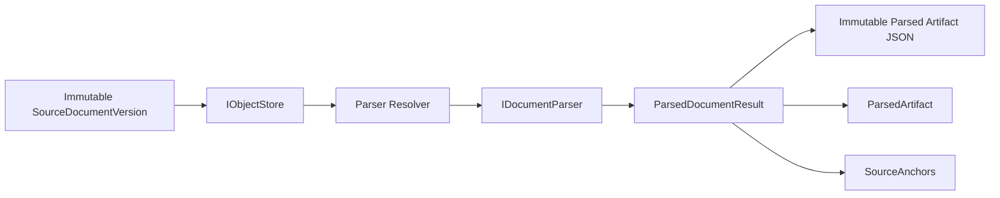
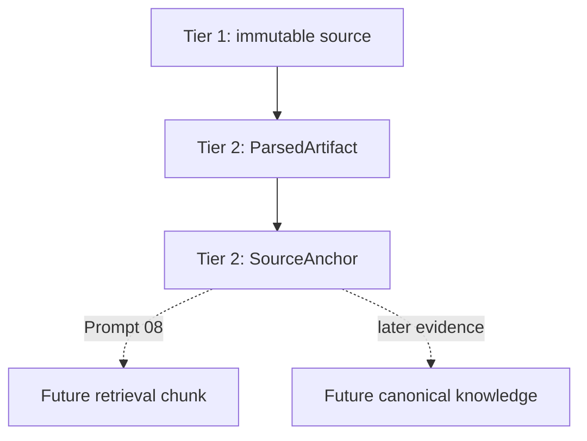

# Parsing and source anchors

Loregrove parses immutable TXT and Markdown source objects into durable Tier-2 observations. Parsing
changes the representation of evidence; it does not increase its authority. The captured source
object remains the authoritative Tier-1 evidence and parsed output never creates facts, entities,
claims, relationships, categories, summaries, or canonical knowledge.



## Trust placement



A `SourceAnchor` is a stable evidence location and normalized observation. It is not a retrieval
chunk. Prompt 08 may derive one chunk from one anchor, several anchors, or part of a large anchor
without changing the evidence records created here.

## Parser contract and selection

`IDocumentParser` receives a forward-readable source stream and a neutral `ParseSourceDescriptor`.
The descriptor contains the strongly typed version ID, captured content hash, untrusted original
filename, and optional captured media type. A parser has no access to EF, SQLite, filesystem paths,
MAUI, Fluent UI, processing jobs, AI providers, or artifact-store implementations.

Each `ParserDescriptor` records parser ID, parser version, output schema version, SHA-256
configuration fingerprint, and SHA-256 parser fingerprint over all preceding output-affecting
inputs.

The resolver prefers a specific supported media type (`text/plain` or `text/markdown`) even when the
extension conflicts. Missing or generic `application/octet-stream` metadata falls back to `.txt`,
`.md`, or `.markdown`. A specific unsupported media type does not fall back by extension. Resolution
is deterministic and never inspects a path, source bytes, remote service, or AI model.

Prompt 05 provides two in-process parsers:

- TXT: BOM-aware Unicode/strict UTF-8 line reading, LF-normalized paragraph text, blank-line
  paragraph boundaries, and 1-based original line ranges;
- Markdown: Markdig CommonMark AST parsing for headings, paragraphs, list items, block quotes,
  fenced/indented code, and raw HTML observations.

Empty TXT is a valid zero-block artifact. Invalid UTF-8, NUL content, and strongly binary-like
control-character input fail safely. Markdown links and images retain useful link/alt text without
fetching URLs. Raw HTML is preserved as plain source text and is never executed or used to load
remote content.

## Normalized blocks and locators

`ParsedDocumentResult` contains only a parser descriptor, ordered blocks, and deterministic metadata.
It contains no timestamps, EF entities, or storage paths. Block ordinals are contiguous and each
non-empty block has a kind, normalized Unicode text, typed locator, and heading path.

Prompt 05 locator types are:

- `TextSourceLocator`: 1-based start/end lines and optional character offsets;
- `MarkdownSourceLocator`: 1-based original AST source lines, block ordinal, and hierarchical heading
  path.

Future PDF page/bounding-box, DOCX paragraph, spreadsheet cell/range, and image-region locators can
extend `SourceLocator`. Persistence records `LocatorKind`, `LocatorSchemaVersion`, and deterministic
`LocatorJson`. The SQLite-owned `ISourceLocatorCodec` implementation rejects unknown kinds, schemas,
properties, and malformed payloads; public evidence reads return typed locators rather than JSON.

## Parsed artifacts and anchors

`ParsedArtifact` records its typed ID, source version, source hash, parser ID/version/configuration
fingerprint/parser fingerprint, schema version, artifact hash/object key, relational creation time,
block count, and current flag. `SourceAnchor` records its typed ID, artifact and source version IDs,
ordinal, block kind, locator kind/schema/JSON, normalized text, and SHA-256 normalized-text hash.

The normalized JSON excludes creation timestamps and absolute paths. `Utf8JsonWriter` writes fields
in a fixed order, metadata in ordinal key order, blocks in ordinal order, and compact UTF-8
consistently. Identical source, parser fingerprint, and normalized result therefore produce identical
bytes and SHA-256.

Artifact objects use:

```text
<LibraryRoot>/
  artifacts/
    parsed/
      .tmp/
      <first-two-hash-characters>/
        <complete-sha256>.json
```

The local artifact store streams into a unique temporary file while hashing, flushes and closes it,
then moves without overwrite. Concurrent identical writers converge on the immutable existing file.
Object keys are derived only from the artifact hash; original filenames never construct paths.

## Transaction, retry, and concurrency

```mermaid
stateDiagram-v2
    [*] --> PendingParsing
    PendingParsing --> Parsing: durable claim; AttemptCount + 1
    Parsing --> Parsed: relational commit succeeds
    Parsed --> PendingChunking: same commit
    Parsing --> ParseFailed: parser failure
    ParseFailed --> Parsing: explicit retry
    Parsing --> PendingParsing: cancellation or recovery
```



The existing `ProcessingJob` is the narrow durable claim. One conditional SQLite update changes a
pending job to Processing/Parsing and increments `AttemptCount`; concurrent requests observe Busy or
the already committed artifact. Unsupported sources return Unsupported before a claim, remain
Pending/Parsing, and do not increment attempts.

After parser success, Loregrove finalizes the deterministic artifact file. One relational transaction
marks a prior artifact non-current, inserts the new artifact and complete anchor set, sets the source
to Parsed, advances the job to Pending/Chunking, and clears `LastError`.

The partial unique index on current artifacts enforces at most one current artifact per source
version. `(DocumentVersionId, ParserFingerprint)` is also unique. The same fingerprint returns
AlreadyParsed without another attempt. A changed fingerprint creates a new artifact and anchors,
preserves the old records/files, and switches current status transactionally.

Artifact files intentionally remain outside SQLite. A finalized file followed by rollback,
cancellation near commit, or relational failure is a safe immutable orphan. Rollback never deletes a
finalized artifact because a concurrent operation may already reference the same content; future
maintenance can garbage-collect unreachable hashes.

An explicit parser-input failure commits ParseFailed/Failed/Parsing with a bounded generic message and
no partial evidence; parser exception detail and source text never enter `LastError`. Unexpected
storage or infrastructure faults propagate while the job returns to retryable Pending/Parsing.
Explicit retry increments the attempt again. Cancellation after a claim keeps its consumed attempt
but returns the source and job to PendingProcessing/Pending/Parsing with no error. Startup recovery
atomically resets an interrupted Processing/Parsing job and its visually Parsing source to those same
retryable states without incrementing attempts.

## Evidence reads and later extension

`IParsedEvidenceReader` provides provider-neutral reads of the current artifact and its ordered
anchors. Artifact bytes can be opened and SHA-256 verified for diagnostics or reprocessing without
paying that cost on every routine query.

PDF, DOCX, PPTX, images, spreadsheets, OCR, and other complex formats return Unsupported in Prompt
05. Their pending Parsing jobs remain retryable. Prompt 06 can add a managed Docling supervisor and
Prompt 07 can add complex-format parser adapters behind the same contract. Neither needs to alter the
trust model, artifact identity, locator envelope, or transaction semantics established here.

No worker process, chunk, FTS table, embedding, vector index, AI provider, generated knowledge, or
source preview is introduced by this architecture.
