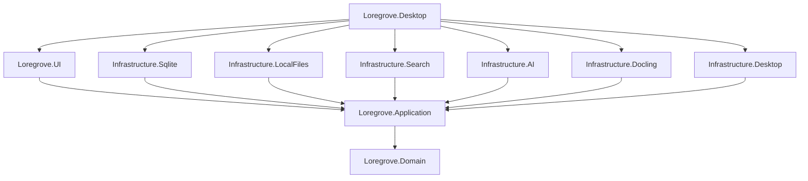
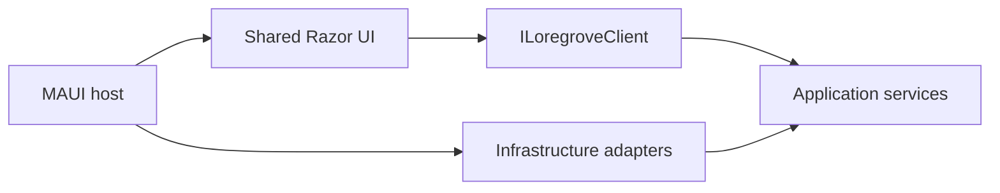

# Production boundaries

## Dependency direction

Loregrove is a local modular monolith. Every production project has one explicit responsibility and
dependencies point inward toward Application and Domain.

Automated architecture tests parse production project files and enforce this exact reference graph.
They also reject MAUI or Infrastructure dependencies in shared UI, duplicate Razor screens in the
native host, extra mobile/Linux targets, and source code that creates a localhost server.

## Runtime boundary

Razor calls C# application services in process. There is no ASP.NET host, HTTP transport, REST API,
or serialization boundary inside the desktop application.

## Current implementation boundary

Prompt 01 provides:

- the stable UI-facing facade and placeholder area clients;
- host-neutral desktop, drop, and secret-store contracts;
- a shared Fluent UI shell and seven primary routes;
- safe placeholder Infrastructure modules other than local files;
- MAUI composition for Windows and Mac Catalyst.

Prompt 02 adds:

- strongly typed source document, immutable version, and pending processing-job concepts;
- stream-neutral import orchestration and atomic metadata repository boundary;
- idempotent local library initialization;
- crash-safe SHA-256 content-addressed object storage in `Infrastructure.LocalFiles`;
- exact duplicate, cancellation, and concurrent-write behavior.

Prompt 03 adds:

- EF Core as an intentional Application persistence programming model;
- SQLite tables and the initial migration in `Infrastructure.Sqlite`;
- atomic source document, version, and processing-job capture;
- durable processing jobs and interrupted-job recovery;
- WAL, foreign-key, busy-timeout, and integrity diagnostics.

Parsing, search, embeddings, provider SDKs, Docling process management, and knowledge extraction
remain deferred. See [local source capture](source-capture.md) and
[SQLite persistence](sqlite-persistence.md).

## Pinned baseline

| Component | Version |
| --- | --- |
| .NET SDK | `10.0.110` |
| .NET MAUI | `10.0.90` |
| MAUI BlazorWebView | `10.0.90` |
| ASP.NET Core Components Web | `10.0.10` |
| Fluent UI Blazor | `5.0.0-rc.4-26180.1` |
| xUnit | `2.9.3` |
| EF Core | `10.0.10` |

Fluent UI Blazor v5 remains pinned to the Prompt 00 prerelease RC. The host loads
`initializersLoader.webview.js` before `blazor.webview.js`; removing this workaround requires a
documented dependency upgrade and Hybrid runtime validation.
