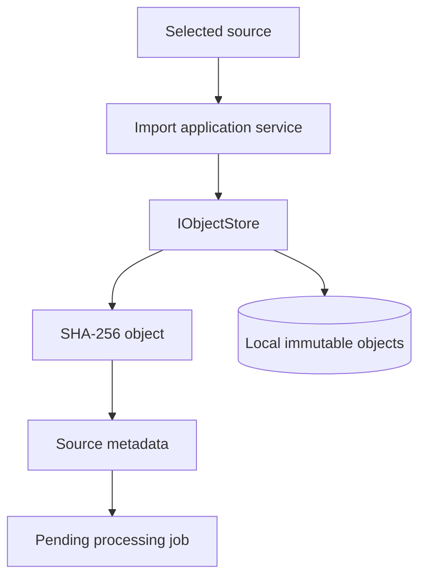
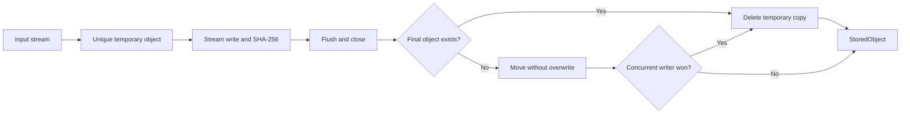
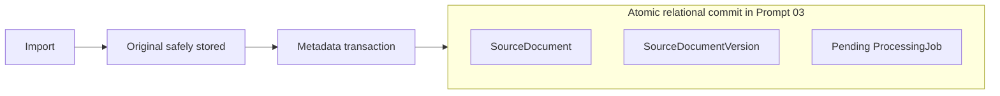

# Local source capture

Loregrove preserves the exact original bytes before metadata is committed or future processing is
requested. Application code works with streams and opaque object keys; it never receives an object
filesystem path.



## Library and object layout

The desktop composition boundary chooses the library root and supplies it through `ILibraryPaths`.
Initialization creates the following layout idempotently and never removes existing data:

```text
<library-root>/
  objects/
    .tmp/
    ab/
      abcdef...  # complete 64-character lowercase SHA-256 hash
  artifacts/
  indexes/
  backups/
  logs/
```

An object key is the platform-neutral string `<first-two-hash-characters>/<complete-hash>`, using a
forward slash regardless of host OS. Filesystem adapters translate that key with portable path APIs.
The supplied filename is retained only as untrusted metadata and never participates in the object
key or path.

## Write, duplicate, and crash behavior



Input is copied through a bounded buffer while SHA-256 is computed. The temporary file is flushed
and closed before it is moved to its final name. The move never overwrites an existing object. If a
concurrent writer wins between the existence decision and the move, the loser reuses the completed
object and removes its temporary copy. A final object path therefore never exposes a partial write.

Exact byte duplicates have the same hash and reuse the same stored object. The metadata repository's
atomic `TryAddCaptureAsync` operation also enforces exact-content uniqueness, so renamed copies return
the existing document and version with an `AlreadyExists` disposition. Changed bytes receive a new
hash and are captured as an independent logical source; Loregrove does not infer a version relationship
during capture.

Known failures and cancellation attempt to remove the unique temporary file. Cancellation is checked
throughout streaming and again before finalization. It creates no source metadata or processing job.
An unexpected process termination may leave a `.tmp` file, which is never a visible finalized object
and can be removed by later maintenance.

## Metadata and processing transaction



The object file is intentionally outside the future SQLite transaction. `SourceDocument`, its initial
immutable `SourceDocumentVersion`, and the pending `ProcessingJob` must commit together behind the
repository boundary. Processing cannot begin before this succeeds.

If the relational commit fails, the finalized content-addressed object remains. This is a safe and
expected orphan state: the object is immutable, may already be shared by another capture, and can be
garbage-collected after references are known. Capture rollback must not delete a finalized object
unless it can prove that the object is unreferenced.
