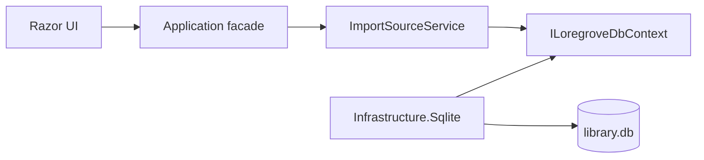
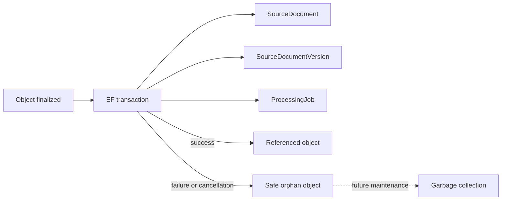
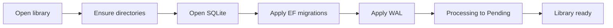

# SQLite persistence

Loregrove stores source metadata and durable processing jobs in `<library-root>/library.db`. The host
selects the library root and supplies a resolved database path through `ILibraryPaths`; Application
does not construct filesystem paths.

## Boundary

EF Core is intentionally allowed in `Loregrove.Application`, including `DbSet<T>`, focused LINQ
queries, async query APIs, and transaction orchestration. Domain and UI remain EF-independent.
`Microsoft.EntityFrameworkCore.Sqlite`, `Microsoft.Data.Sqlite`, connection strings, PRAGMAs,
migrations, and provider exception inspection are isolated to `Loregrove.Infrastructure.Sqlite`.



## Tables and indexes

`SourceDocuments` stores the logical source identity, display name, source kind, creation time, and
typed current-version identifier. `SourceDocumentVersions` stores immutable capture metadata.
`ProcessingJobs` stores the durable processing lifecycle, current stage, bounded diagnostic text, and
retry count. `ParsedArtifacts` and `SourceAnchors` store immutable Tier-2 parser evidence; see
[parsing and source anchors](parsing-and-source-anchors.md).

The schema enforces:

- `SourceDocumentVersions.DocumentId` → `SourceDocuments.Id` with restricted deletion;
- `SourceDocumentVersions.PreviousVersionId` → `SourceDocumentVersions.Id` with restricted deletion;
- `ProcessingJobs.DocumentVersionId` → `SourceDocumentVersions.Id` with restricted deletion;
- unique `SourceDocumentVersions.ContentHash` for exact-byte deduplication;
- unique `ProcessingJobs.DocumentVersionId` for one initial job per version;
- indexes on version `DocumentId`, optional `PreviousVersionId`, and job `State`;
- unique `(DocumentVersionId, ParserFingerprint)` parsed artifacts and one filtered current artifact
  per source version;
- unique `(ParsedArtifactId, Ordinal)` anchors plus artifact/version evidence indexes.

`SourceDocuments.CurrentVersionId` remains a required strongly typed value but is not an initial-schema
foreign key. Enforcing both it and the required version-to-document relationship would create an
immediate insertion cycle in SQLite. Version ownership is the enforced relational direction; this
choice should be reconsidered when multi-version mutation is introduced.

## Capture transaction

The original object is finalized before relational work begins. One EF transaction then inserts the
document, version, and pending job and commits them together.



The database unique constraint is the final concurrency guard. A provider-specific unique violation
is classified in Infrastructure.Sqlite and translated by Application to `AlreadyExists`; SQLite
exceptions do not escape to UI callers. Finalized objects are never deleted during relational
rollback because another capture may reference the same immutable content.

## Connection and startup behavior

Each independent use case receives a scoped DbContext. Contexts are never shared across concurrent
operations. Every EF-opened connection applies:

```sql
PRAGMA foreign_keys=ON;
PRAGMA busy_timeout=5000;
```

Initialization applies `PRAGMA journal_mode=WAL;`. WAL mode persists in the database, while foreign
keys and the 5,000 ms busy timeout are connection-level settings and are reapplied by a connection
interceptor. The connection string also enables foreign keys and a five-second default timeout.

Library initialization is idempotent:



Jobs left in `Processing` after process termination return to `Pending` at startup. For the Parsing
stage, recovery also returns a source left in `Parsing` to `PendingProcessing`. Recovery updates
`UpdatedAt` but does not increment `AttemptCount` and does not alter completed or failed jobs.

## Migrations and diagnostics

Production initialization uses `Database.MigrateAsync`; it never uses `EnsureCreated`. The design-time
factory lives with SQLite infrastructure, so migration generation does not launch MAUI. The initial
migration is `20260811183241_InitialSqlitePersistence`. Prompt 05 parsing evidence is added by
`20260812110753_DurableParsedArtifactsAndSourceAnchors`.

`IDatabaseIntegrityDiagnostics.QuickCheckAsync` exposes SQLite `PRAGMA quick_check` on demand. A full
integrity scan is not run for routine operations.

## Backup implication

Backup execution is deferred. A future backup must use a SQLite-consistent backup/checkpoint strategy;
it must not copy only `library.db` while active WAL data may still reside in `library.db-wal`. Prompt 17
must account for the database, WAL, and shared-memory state.
