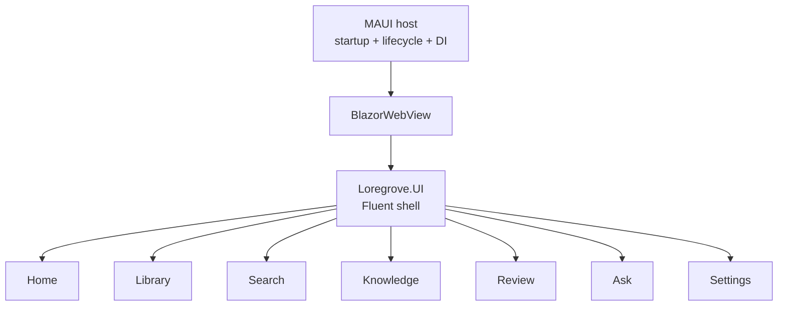
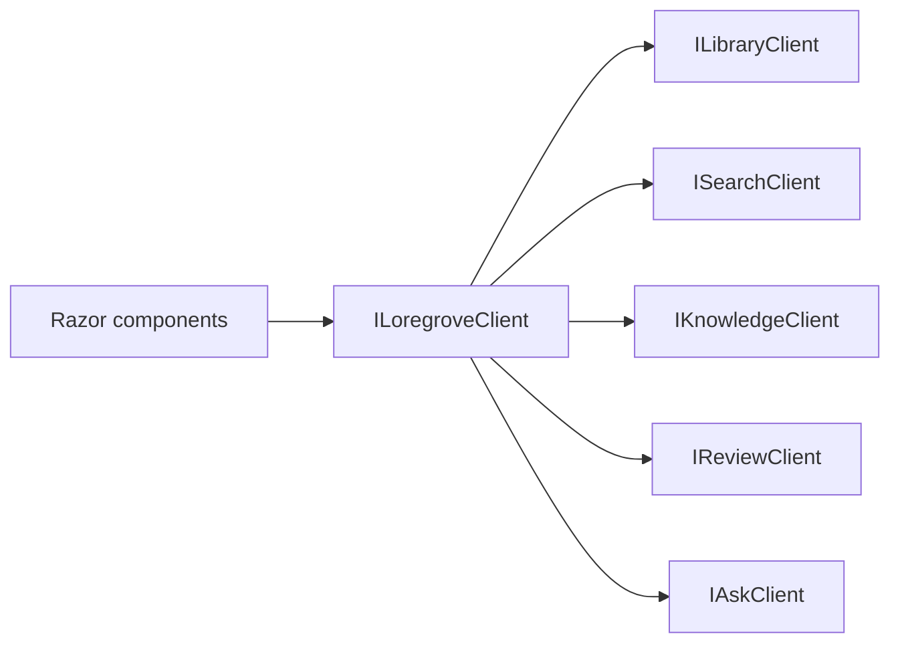
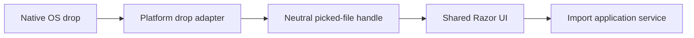

# UI and platform capabilities

## Shared UI

Primary application screens exist only in `Loregrove.UI`. The native MAUI host creates a window,
hosts a `BlazorWebView`, registers platform capabilities, and manages lifecycle.

## Fluent-first component rule

`Loregrove.UI` must prefer Fluent UI Blazor v5 whenever an appropriate Fluent component exists for
an interactive control, application feedback surface, disclosure control, navigation affordance,
data presentation widget, or standard layout primitive. Native HTML remains appropriate for
semantic document structure where a Fluent component provides no meaningful application behavior or
accessibility advantage.

Prefer Fluent components for application widgets:

| Purpose | Component |
| --- | --- |
| Action | `FluentButton` |
| Application link | `FluentAnchor` or the pinned package's `FluentAnchorButton` |
| Search | `FluentSearch` or a search-typed Fluent input when unavailable in the pinned package |
| Text/select/checkbox | `FluentTextInput`, `FluentSelect`, `FluentCheckbox` |
| Dialog | `FluentDialog` |
| Error or notification | `FluentMessageBar` |
| Status | `FluentBadge` |
| Progress | `FluentProgressBar`, `FluentSpinner` |
| Data table | `FluentDataGrid` |
| Disclosure | `FluentAccordion` |
| Pagination | `FluentPaginator` where compatible with the data-loading model |
| Standard flex layout | `FluentStack` when it reduces layout plumbing |

Keep semantic HTML such as headings, paragraphs, emphasis, time, sections, articles, navigation,
lists, and description lists. Fluent-first is not a ban on HTML. Production Razor files may not use
raw `button`, `input`, `select`, `textarea`, or `details` widgets unless an architecture document
records why the Fluent equivalent is unsuitable and the architecture guardrail is updated with a
narrow, named exception.

Home is a bootstrap status surface. The other routes are explicit placeholders and do not claim
unimplemented product behavior, except Library which now implements durable source import and
browsing.

## UI-facing application facade

Razor components depend on this stable facade rather than arbitrary handlers. Product operations
will be added to the area interfaces only when their owning milestones define them.

## Desktop capability boundary

`IDesktopPlatform`, `IDesktopDropAdapter`, and `ISecretStore` live in Application. Implementations
live outside Domain, Application, and UI. Prompt 01 registers safe non-persisting placeholders;
native Windows and Mac Catalyst capability implementations remain validation-gated work.

Opaque picker handles must not be interpreted as filesystem paths by shared code. This is important
for sandboxed and security-scoped access on macOS.

## Native drag/drop

HTML drag/drop exposes browser metadata but does not provide reliable durable access to native files.
The production direction is therefore a host adapter rather than a DOM-only import path.

The `IDesktopDropAdapter` subscription contract reserves this integration point. Prompt 01 does not
implement native drop registration or document import.
