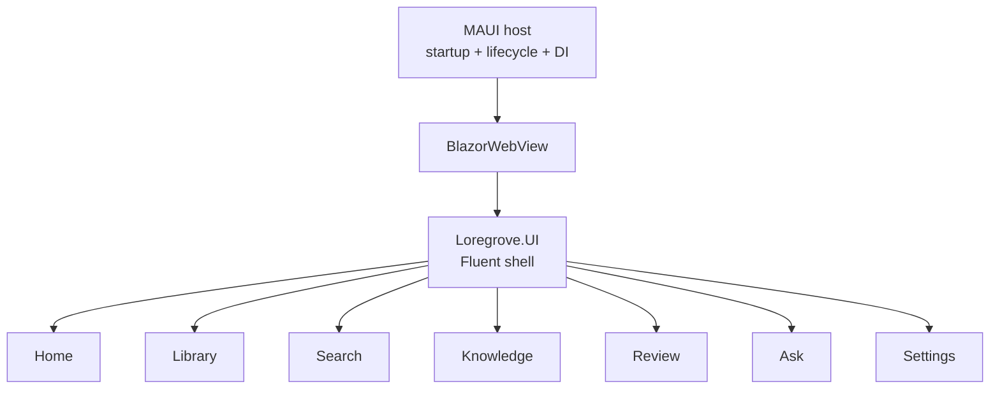
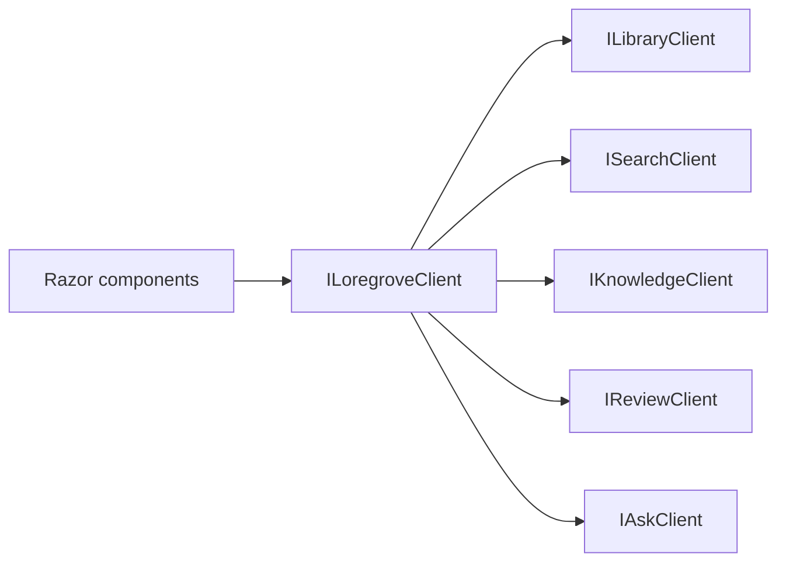
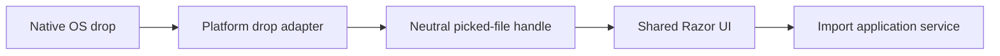

# UI and platform capabilities

## Shared UI

Primary application screens exist only in `Loregrove.UI`. The native MAUI host creates a window,
hosts a `BlazorWebView`, registers platform capabilities, and manages lifecycle.

Home is a bootstrap status surface. The other routes are explicit placeholders and do not claim
unimplemented product behavior.

## UI-facing application facade

Razor components depend on this stable facade rather than arbitrary handlers. Product operations
will be added to the area interfaces only when their owning milestones define them.

## Desktop capability boundary

`IDesktopPlatform`, `IDesktopDropAdapter`, and `ISecretStore` live in Application. Implementations
live outside Domain, Application, and UI. Prompt 01 registers safe non-persisting placeholders;
native Windows and Mac Catalyst capability implementations remain validation-gated work.

Opaque picker handles must not be interpreted as filesystem paths by shared code. This is important
for sandboxed and security-scoped access on macOS.

## Native drag/drop

HTML drag/drop exposes browser metadata but does not provide reliable durable access to native files.
The production direction is therefore a host adapter rather than a DOM-only import path.

The `IDesktopDropAdapter` subscription contract reserves this integration point. Prompt 01 does not
implement native drop registration or document import.
