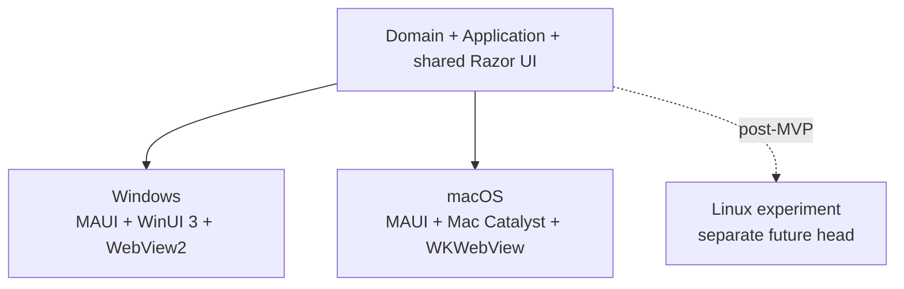

# Desktop platform targets

Windows and macOS are first-class MVP targets and share the same production Razor UI.

- [Windows validation](windows-validation.md)
- [macOS validation](macos-validation.md)

There is no Linux head in the production repository bootstrap.
