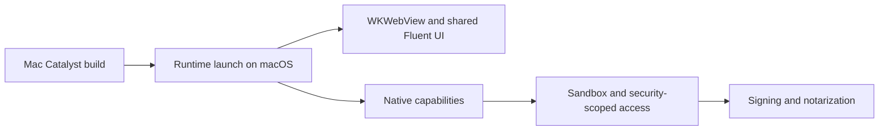

# macOS validation

## Current status

The production Mac Catalyst target builds from the shared codebase, but Prompt 00 did not execute on
macOS. Every runtime, capability, security, and distribution item below remains open until exercised
on a Mac.

Prompt 04 uses MAUI's neutral `FileResult.OpenReadAsync` lifetime rather than retaining local paths.
That preserves room for security-scoped access, but it does not complete the runtime validation gate.

## Validation checklist

- [ ] Launch the production application on macOS.
- [ ] Confirm WKWebView startup and clean shutdown.
- [ ] Confirm the shared Fluent UI theme renders correctly.
- [ ] Exercise the file picker.
- [ ] Exercise the folder picker.
- [ ] Prove security-scoped file and folder access after picker dismissal.
- [ ] Decide whether durable security-scoped bookmarks are required.
- [ ] Implement and exercise native drag/drop.
- [ ] Exercise SecureStorage and confirm Keychain-backed behavior.
- [ ] Exercise Finder reveal behavior under App Sandbox.
- [ ] Validate Cmd keyboard shortcuts and Mac Catalyst desktop UX.
- [ ] Validate graph interaction when the production graph exists.
- [ ] Validate Markdown rendering when the production Markdown surface exists.
- [ ] Validate signing.
- [ ] Validate notarization.
- [ ] Review and minimize entitlements.
- [ ] Validate packaging and normal installation.
- [ ] Repeat the production data-grid interaction and performance gate when the grid exists.

## Evidence policy

A cross-build or CI compile is build evidence only. It does not complete runtime, WKWebView,
capability, sandbox, signing, notarization, or interaction checks. Each item requires recorded macOS
execution evidence before it can be marked complete.
