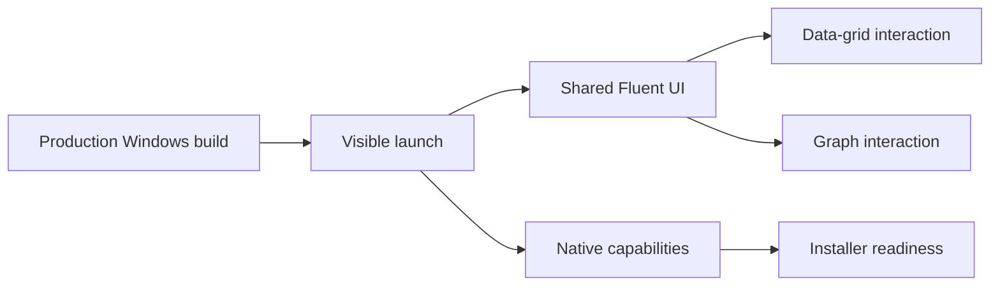

# Windows validation

## Current status

The production target is `net10.0-windows10.0.19041.0`. Prompt 00 proved the architectural host on
Windows, but the production host must retain the outstanding interactive checks below. Repository
creation is not blocked by this debt.

Prompt 04 implements the MAUI multi-file picker and the production Library grid. A successful
Windows target build proves API and composition compatibility only; the interactive picker and
restart smoke steps below still require a visible desktop session.

## Prompt 04 runtime observation — 2026-08-12

The Release application launched in a visible Windows session and remained responsive. The native
picker imported the following sources from a directory whose name contained spaces:

- `Résumé notes.md`;
- a 107-character text filename.

Direct inspection of the production SQLite library confirmed both Unicode/long filename rows and
their immutable objects. Loregrove was closed, relaunched, and remained responsive; the same durable
rows were still present in SQLite after restart. This is runtime evidence for picker access, capture,
and restart durability. Picker cancellation and a recorded visual confirmation of the rows after
restart remain open rather than being inferred from database inspection.

## Validation checklist

- [ ] Launch the production host in a visible Windows session.
- [ ] Confirm the shared Razor shell and Fluent theme render.
- [ ] Repeat the final `FluentDataGrid` test with 10,000 records when the production grid exists.
- [ ] Validate grid scrolling.
- [ ] Validate user-entered filtering.
- [ ] Validate grid selection.
- [ ] Validate an interactive graph-node callback when the production graph exists.
- [x] Exercise the file picker.
- [x] Import a long filename, a Unicode filename, and files under a path containing spaces.
- [ ] Record separate one-file and multi-file selection observations.
- [ ] Cancel the picker and confirm no synthetic import result is created.
- [ ] Close and reopen Loregrove and confirm imported rows remain visible.
- [ ] Exercise the folder picker.
- [ ] Exercise clipboard writing.
- [ ] Exercise SecureStorage behavior.
- [ ] Exercise opening an external file.
- [ ] Exercise revealing a file in Explorer.
- [ ] Implement and exercise native file drag/drop with durable file access.
- [ ] Confirm keyboard shortcuts and accessibility behavior.
- [ ] Decide and validate WebView2 Evergreen Runtime installer prerequisite handling.
- [ ] Repeat release process-tree memory measurements on representative surfaces.

## Preserved constraints

- Set `WEBVIEW2_USER_DATA_FOLDER` to a writable app-data directory before WebView creation.
- Use native window initialization for a future WinRT folder picker.
- Treat HTML drag/drop metadata as non-authoritative.
- Validate the installer/runtime prerequisite separately from the presence of `WebView2Loader.dll`.

Nothing in this document is marked complete solely because a production project compiles.
