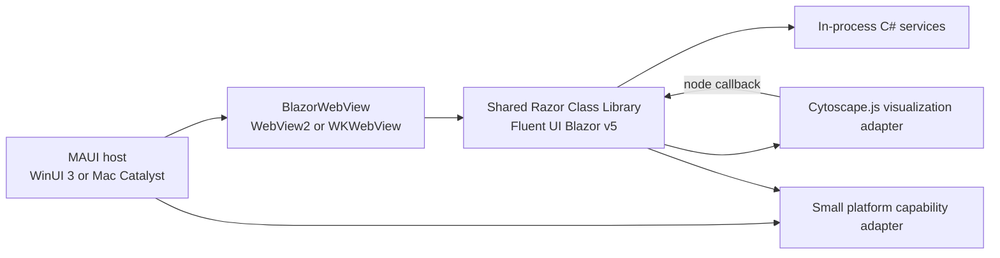

# Desktop platform spike result

Date: 2026-08-11

## Verdict

**Windows: CONDITIONAL PASS**

**macOS: NOT EXECUTED** (the Mac Catalyst target builds successfully for x64 and arm64; runtime, signing, notarization, and capability behavior were not executed on macOS).

**Shared UI: PASS at the code/build boundary.** Every primary screen is implemented once in `Loregrove.PlatformSpike.UI`; the MAUI host has no product screens.

**Final recommendation: CONDITIONAL PASS — proceed with listed constraints**

Proceed to Prompt 01 only if the first bootstrap milestone retains the macOS runtime gate and repeats the final `FluentDataGrid` performance/capability checks on visible Windows and macOS sessions. No compile-time architectural blocker was found.

## Architecture validated



There is no ASP.NET host, localhost listener, HTTP client, REST API, or serialization boundary between Razor and C# services.

## Versions tested

| Dependency | Exact version/result |
| --- | --- |
| .NET SDK | `10.0.110` |
| .NET runtime | `10.0.10` |
| Workload manifest | `10.0.110.1` |
| .NET MAUI packages | `10.0.90` |
| `Microsoft.AspNetCore.Components.WebView.Maui` | `10.0.90` |
| `Microsoft.FluentUI.AspNetCore.Components` | `5.0.0-rc.4-26180.1` (prerelease, explicitly pinned) |
| `Microsoft.AspNetCore.Components.Web` | `10.0.10` |
| WebView2 package | `1.0.3179.45` (transitive) |
| Windows App SDK | `1.8.260508005` (transitive) |
| Markdig | `1.3.2` |
| Cytoscape.js | `3.33.4`, vendored browser asset with its MIT notice; no Node application runtime |

Central Package Management is enabled in `spikes/desktop-platform/Directory.Packages.props`. The selected versions were checked against the [BlazorWebView NuGet release list](https://www.nuget.org/packages/Microsoft.AspNetCore.Components.WebView.Maui/), [Fluent UI Blazor NuGet release list](https://www.nuget.org/packages/Microsoft.FluentUI.AspNetCore.Components/), [Markdig NuGet release list](https://www.nuget.org/packages/Markdig/), and [Cytoscape.js releases](https://github.com/cytoscape/cytoscape.js/releases).

The local machine had the MAUI SDK/reference/runtime packs but did not report a registered workload in `dotnet workload list`. Both requested targets still restored and built. A clean CI runner must run `dotnet workload install maui`; the workflow does so.

## Windows result — CONDITIONAL PASS

Validated on Windows 11 build `10.0.26100`, x64:

- Release build for `net10.0-windows10.0.19041.0`: success, zero warnings.
- Native launch: success; the main window title was `Loregrove Platform Spike`.
- Final published-artifact launch produced a native window in approximately 4.35 seconds.
- WebView host: `msedgewebview2.exe` was observed as the renderer child.
- The Hybrid page reported `https://0.0.0.1/`, the internal `BlazorWebView` virtual origin—not a network listener.
- Shared Razor Home, Library, Markdown, and graph surfaces were rendered in a diagnostic run.
- Self-contained unpackaged publish: success using `RuntimeIdentifierOverride=win10-x64` and `WindowsAppSDKSelfContained=true`.
- Publish output: 493 files, approximately 176.6 MiB.
- `WebView2Loader.dll` is present. The Evergreen WebView2 Runtime is still a deployment prerequisite; it is not the same thing as the loader. Microsoft documents packaged/unpackaged options in [Publish a .NET MAUI app for Windows](https://learn.microsoft.com/en-us/dotnet/maui/windows/deployment/overview?view=net-maui-10.0).
- `WEBVIEW2_USER_DATA_FOLDER` is set to a writable app-data directory before the WebView is created, following Microsoft’s WebView guidance.

Not completed on this machine:

- visible/manual navigation and accessibility pass;
- hands-on file/folder picker, clipboard, secure storage, open/reveal, and drag/drop checks;
- a final runtime timing pass after replacing the prototype rows with `FluentDataGrid`;
- installer/MSIX prerequisite behavior.

## macOS result — NOT EXECUTED

Validated from the Windows build host:

- Release build for `net10.0-maccatalyst`: success, zero warnings.
- Outputs produced for `maccatalyst-x64` and `maccatalyst-arm64`.
- The exact same `Loregrove.PlatformSpike.UI` project is referenced.
- The native folder picker adapter compiles against `UIDocumentPickerViewController` and [.NET's `UTTypes.Folder` binding](https://learn.microsoft.com/en-us/dotnet/api/uniformtypeidentifiers.uttypes.folder?view=net-ios-26.2-10.0).
- A `macos-15` CI job installs MAUI, runs tests, and builds Mac Catalyst without signing.

Not validated:

- launch/WKWebView behavior;
- file and folder access after picker dismissal, including security-scoped URL lifetime/bookmarks;
- drag/drop paths;
- Keychain-backed `SecureStorage` behavior;
- `open -R` Finder reveal behavior under App Sandbox;
- Cmd shortcuts and Mac Catalyst desktop UX;
- signing, package creation, notarization, and entitlements on a Mac.

Distribution requires Apple certificates and provisioning. Outside-store distribution also requires notarization; see Microsoft’s [Mac Catalyst publishing guidance](https://learn.microsoft.com/en-us/dotnet/maui/mac-catalyst/deployment/publish-app-store) and [ad-hoc/App Sandbox guidance](https://learn.microsoft.com/en-us/dotnet/maui/mac-catalyst/deployment/publish-ad-hoc?view=net-maui-10.0). The spike currently enables App Sandbox and outgoing network access. Product hardening should remove the network entitlement if no feature requires it and add only file-access entitlements proven necessary.

## Fluent UI v5 validation

The spike uses `5.0.0-rc.4-26180.1`; v5 was still prerelease when verified. It was not downgraded to v4.

Concrete v5 APIs compiled and used:

- `FluentNav` and `FluentNavItem`;
- `FluentCard` and `FluentButton` with `ButtonAppearance`;
- `FluentTextInput`, `FluentSelect`, and `FluentOptionString`;
- virtualized `FluentDataGrid` with sortable/resizable columns;
- `FluentProgressBar`;
- `IThemeService`, `ThemeMode.Light`, `ThemeMode.Dark`, and `ThemeMode.System`.

Fluent v5 still ships a documented Blazor Hybrid initializer-loader workaround. `index.html` loads `initializersLoader.webview.js` before `blazor.webview.js`. This is a release risk until the upstream WebView initializer issue is removed and tested without the workaround.

## Large collection observations

The service deterministically creates exactly 10,000 records. The final UI uses a virtualized `FluentDataGrid`, built-in sortable columns, resizable columns, filtering, and a selection/detail action.

An earlier diagnostic surface run observed:

- route/render transition: approximately 232 ms;
- initial 10,000-item projection/sort: approximately 6.4 ms;
- total process-tree working set after Library navigation: approximately 702 MiB.

Those figures are indicative only: the working set includes the app and all isolated WebView2 processes, and the final `FluentDataGrid` replacement was built but not re-measured interactively. Scrolling, user-entered filtering, selection, and final-grid memory remain a required visible smoke gate. There was no managed data-generation or filtering bottleneck in the test run, but practical usability is not yet claimed as fully passed.

## Graph and Markdown observations

Markdown is rendered by Markdig with advanced extensions and raw HTML disabled. The shared `MarkdownView` demonstrated headings, lists, fenced code, links, tables, and blockquotes. Markdig was chosen because it is mature, fast, CommonMark-oriented, reusable from Razor, and avoids a platform implementation.

Cytoscape.js is a shared-UI-only visualization adapter. The canonical graph view model stays in C#. A diagnostic run observed:

- 100 nodes and 300 edges received by Cytoscape.js;
- graph initialization: approximately 200 ms;
- graph route/render transition: approximately 317 ms;
- programmatic pan/zoom update: under 1 ms;
- total process-tree working set after graph navigation: approximately 864 MiB.

The real node handler calls the component through `DotNetObjectReference` and updates selected-node Razor state. The callback path is implemented and compiles, but the external hidden diagnostic context could not reliably dispatch Hybrid event callbacks; visible node-click confirmation remains pending and is a release gate.

Indicative total process-tree memory snapshots from the same diagnostic session:

| Surface | Working set |
| --- | ---: |
| Startup | 660.5 MiB |
| Library | 701.8 MiB |
| Markdown | 718.3 MiB |
| Graph | 863.6 MiB |

The final published desktop process alone used approximately 220.9 MiB shortly after startup. The large difference is the WebView2 multi-process tree. These are smoke observations, not benchmark results.

## Platform capability results

`MauiDesktopPlatformService` is the only OS-facing adapter used by Razor. No secret value is displayed or logged.

| Capability | Windows | macOS |
| --- | --- | --- |
| File picker | Implemented with MAUI multi-file picker; build verified; runtime pending | Same shared MAUI adapter; build verified; runtime pending |
| Folder picker | WinRT picker with native-window initialization; build verified; runtime pending | Native `UIDocumentPickerViewController`; build verified; runtime pending |
| Drag/drop | Shared HTML drop adapter returns name/size/type; runtime pending; no native full path | Same shared adapter; runtime pending; security-scoped file access unresolved |
| Clipboard | MAUI clipboard adapter; build verified; runtime pending | Same adapter; build verified; runtime pending |
| Secure storage | MAUI secure storage adapter; build verified; runtime pending | Keychain-backed behavior expected; runtime pending |
| Open file | MAUI launcher adapter; build verified; runtime pending | Same adapter; build verified; runtime pending |
| Reveal file | `explorer.exe /select`; build verified; runtime pending | `open -R`; build verified; sandbox/runtime pending |
| Keyboard shortcuts | Ctrl+F/Ctrl+O mapping implemented in shared JS | Cmd+F/Cmd+O mapping implemented in shared JS; runtime pending |
| Dark/light theme | v5 theme service + persisted Light/Dark/System choice; rendered build path verified | Same shared implementation; runtime pending |

Drag/drop currently proves WebView metadata handoff, not durable access to the dropped local file. If product import requires full paths/streams from drop, add a native drop adapter per host and pass only neutral file handles/metadata into Razor.

## UI code reuse assessment

```text
Shared Razor UI percentage: 100% of primary spike screens
Windows-only UI code: 0 lines
macOS-only UI code: 0 lines
Shared service code: approximately 80 lines
Platform adapter code: approximately 89 lines plus minimal MAUI composition/XAML
```

All Home, Library/Search, Knowledge, Review, Ask, Settings, Markdown, theme, graph, and drop-zone UI is in the shared RCL. Windows/Mac conditional code exists only in the host capability adapter. There are no duplicate native screens.

## Risks discovered

### Blocking

- None identified at the compile/host architecture boundary.

### High

- Mac Catalyst runtime, WKWebView, signing/notarization, sandbox file access, and Keychain behavior have not executed on macOS.
- Final virtualized `FluentDataGrid` usability and interactive filtering/selection were not measured after the last grid change.
- File drag/drop currently exposes browser metadata only; native access to dropped files needs a proven host adapter.
- Fluent UI v5 is a prerelease RC and requires a Hybrid initializer workaround.

### Medium

- Total Windows process-tree working set reached roughly 864 MiB on the graph surface; repeat with release diagnostics and a stable baseline.
- WebView2 Evergreen Runtime prerequisite handling is not yet represented in an installer/MSIX.
- Platform capability implementations compile but were not exercised interactively.
- The machine’s installed packs built successfully while workload registration remained absent; clean-runner CI is the authoritative setup test.

### Low

- Fluent v5 RC API names changed substantially from v4, so upgrade churn is likely before stable v5.
- The current Mac reveal implementation shells out to `open -R`; a native API may be preferable after sandbox testing.

## Required workarounds and constraints

1. Keep the Fluent Hybrid initializer loader until the upstream issue is confirmed fixed in the pinned version.
2. Set a writable `WEBVIEW2_USER_DATA_FOLDER` before Windows WebView creation.
3. Use WinRT window initialization for the Windows folder picker.
4. Use a native Mac Catalyst document picker for folder selection and investigate security-scoped bookmarks for durable access.
5. Treat WebView drag/drop as metadata-only until native adapters prove file access.
6. Build/sign/notarize Mac artifacts on a Mac; Windows cross-build output is not runtime evidence.
7. Use the MAUI-specific Windows publish RID override; generic `-r win-x64 --self-contained` requested an invalid Mono Windows pack in this multi-target project.

## Acceptance assessment

| Criterion | Result |
| --- | --- |
| .NET 10 MAUI Blazor Hybrid Windows build/launch | Met |
| Mac Catalyst build and pending runtime path | Met (runtime pending, CI path added) |
| Fluent UI Blazor v5 in Hybrid | Met at build/render boundary; interaction pass pending |
| Same shared UI project | Met |
| No duplicated native primary screens | Met |
| 10k navigation practically usable | Conditional; final-grid visible pass pending |
| Markdown | Met |
| Graph JS interop | Render/data path met; visible JS→.NET click pending |
| Direct Razor-to-C# services and progress | Met |
| No local server/REST | Met |
| Platform functions isolated | Met |
| No fundamental Mac Catalyst blocker | No blocker identified; runtime not executed |

## Status Report

- **Current stage:** Prompt 00 architecture validation spike complete with conditional gates.
- **Platform verdict:** Windows CONDITIONAL PASS; macOS NOT EXECUTED; overall CONDITIONAL PASS.
- **Completed:** Isolated solution, shared Fluent v5 UI, virtualized 10k grid, review state, Markdown, graph adapter, direct services/progress, themes, platform adapters, tests, Windows publish, and macOS CI build path.
- **Versions tested:** .NET SDK 10.0.110; MAUI/BlazorWebView 10.0.90; Fluent UI Blazor 5.0.0-rc.4-26180.1; Markdig 1.3.2; Cytoscape.js 3.33.4.
- **Windows validation:** Release build and launch succeeded; WebView2 observed; self-contained unpackaged publish succeeded at approximately 176.6 MiB; hands-on capability and final-grid interaction pass pending.
- **macOS validation:** Mac Catalyst x64/arm64 build succeeded; macOS runtime/signing/notarization/capabilities not executed; macOS CI path added.
- **Fluent UI v5 validation:** RC4 pinned and compiled; v5 nav/input/grid/button/theme APIs used; Hybrid initializer workaround required.
- **10k-row performance:** Data generation/projection was responsive; final `FluentDataGrid` builds with virtualization/sorting/selection; visible performance confirmation remains a high-priority gate.
- **Graph/Markdown validation:** Markdown render and 100-node/300-edge graph render verified; visible graph node callback remains pending.
- **Platform capability results:** All capabilities are isolated and build; interactive runtime confirmation is pending, and native drag/drop file access is incomplete.
- **Architecture risks:** macOS runtime/distribution, Fluent v5 prerelease lifecycle, drag/drop file access, final-grid interaction, and WebView2 memory/prerequisites.
- **Blockers:** No compile-time architecture blocker; evidence is insufficient for an unconditional PASS.
- **Recommended next step:** Proceed with Prompt 01 only under the listed constraints, immediately run the macOS CI/runtime gate, and repeat visible Windows/macOS collection/graph/capability measurements before production UI expansion.
